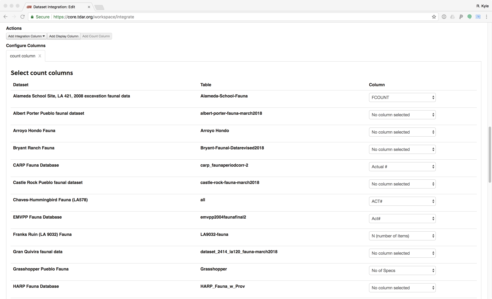
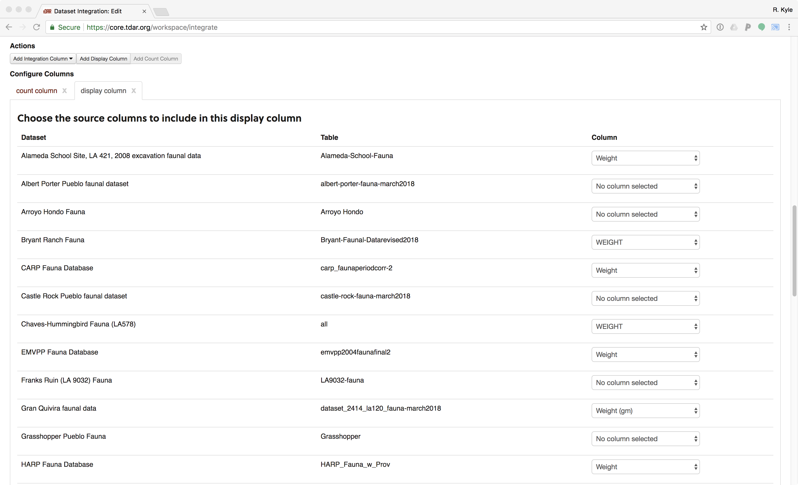
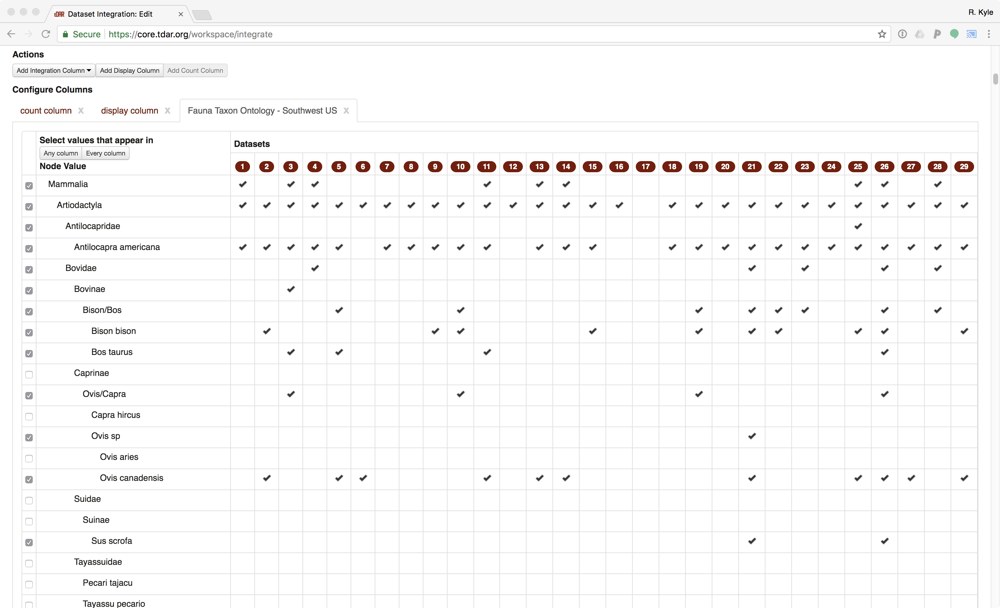
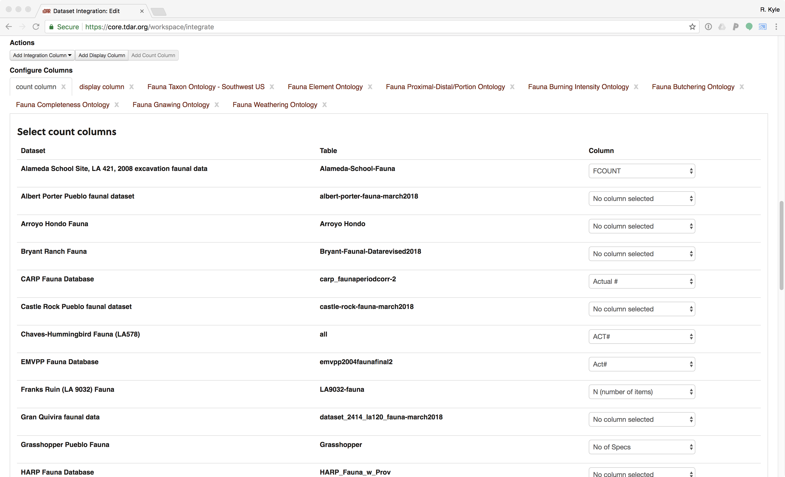

```{r setup, echo = FALSE, warning = FALSE, message = FALSE, error = FALSE, collapse=TRUE, cache=FALSE, results = 'hide'}
# Load the package for this vignette
library(swtp)

# Set the behavior for printing scientific notation
options(digits = 3, 
        scipen = -2)

# Set the knitting behavior
knitr::opts_chunk$set(echo = FALSE,
                      warning = FALSE,
                      message = FALSE,
                      error = FALSE,
                      collapse = TRUE, 
                      results = 'asis',
                      cache = TRUE,
                      out.width = "100%",
                      fig.height = 5
)

# A function that summarizes the data for a variable by dataset
var_summary <- function(x, var){
  quo_var <- rlang::enquo(var)
  x %>%
    dplyr::select(Dataset, !!quo_var) %>%
    dplyr::group_by(Dataset, !!quo_var) %>%
    dplyr::count() %>%
    dplyr::group_by(Dataset) %>%
    tidyr::spread(!!quo_var,
                  n,
                  drop = FALSE) %>%
    dplyr::mutate_at(.vars = dplyr::vars(-dplyr::group_cols()),
                      .funs = function(x){
      ifelse(is.na(x), 0, x)
    }) %>%
    dplyr::ungroup()
}

# A function to further summarize variable data
affected_summary <- function(x, ...){
  affected_var <- rlang::quos(...)
  
  x %>%
    dplyr::mutate(
      `n total` = rowSums(
        dplyr::select(.,
                      -Dataset)
      ) %>%
        as.integer(),
      `n recorded` = rowSums(
        dplyr::select(.,
                      -Dataset,
                      -`Not Recorded`,
                      -MISSING,
                      -`NULL`,
                      -UNMAPPED,
                      -Indeterminate)
      ) %>% 
        as.integer(),
      `p recorded` = `n recorded` / `n total`,
      `n affected` = rowSums(
        dplyr::select(.,
                      !!!affected_var)
      ) %>% 
        as.integer(),
      `p affected` = `n affected`/`n recorded`,
      `p affected CI lower` = purrr::map2_dbl(`n affected`,
                                              `n recorded`,
                                              function(x,y){
                                                ifelse(y > 0, 
                                                       binom.test(x,y)$conf.int[[1]],
                                                       NA)
                                              }),
      `p affected CI upper` = purrr::map2_dbl(`n affected`,
                                              `n recorded`,
                                              function(x,y){
                                                ifelse(y > 0, 
                                                       binom.test(x,y)$conf.int[[2]],
                                                       NA)
                                              })
    ) %>%
    dplyr::select(Dataset,
                  `n total`,
                  `n recorded`,
                  `p recorded`:`p affected CI upper`)
  
}

# Thresholds for inclusion used in this study
nisp_threshold <- 25
prop_threshold <- 0.4
nisp_element_threshold <- 5

apply_thresholds <- function(x){
  x %>%
    dplyr::mutate(`p affected` = ifelse(!(`n total` >= nisp_threshold & 
                                            `p recorded` >= prop_threshold), 
                                        NA, 
                                        `p affected`),
                  `p affected CI lower` = ifelse(!(`n total` >= nisp_threshold & 
                                                     `p recorded` >= prop_threshold), 
                                                 NA, 
                                                 `p affected CI lower`),
                  `p affected CI upper` = ifelse(!(`n total` >= nisp_threshold & 
                                                     `p recorded` >= prop_threshold), 
                                                 NA, 
                                                 `p affected CI upper`)) %>%
    dplyr::filter(!is.na(`p affected`))
}

apply_element_thresholds <- function(x){
  x %>%
    dplyr::mutate(`p affected` = ifelse(!(`n recorded` >= nisp_element_threshold), 
                                        NA, 
                                        `p affected`),
                  `p affected CI lower` = ifelse(!(`n recorded` >= nisp_element_threshold), 
                                                 NA, 
                                                 `p affected CI lower`),
                  `p affected CI upper` = ifelse(!(`n recorded` >= nisp_element_threshold), 
                                                 NA, 
                                                 `p affected CI upper`)) %>%
    dplyr::filter(!is.na(`p affected`))
}

# A plotting function for the summary data
plot_summary <- function(x){
  (x %>% 
     dplyr::arrange(-`p affected`,`p affected CI lower`) %>%
     ggplot2::ggplot(mapping = ggplot2::aes(x = Dataset %>%
                                              reorder(-`p affected CI lower`) %>%
                                              reorder(-`p affected`),
                                            y = `p affected`,
                                            text = paste0(Dataset,"\n",
                                                          "Taxon NISP recorded: ", `n recorded`,"\n",
                                                          "Prop. affected: ", `p affected` %>% 
                                                            round(digits = 3),"\n"
                                            ))) +
     ggplot2::geom_pointrange(ggplot2::aes(ymin = `p affected CI lower`,
                                           ymax = `p affected CI upper`)) +
     ggplot2::xlab("") +
     ggplot2::ylab("Proportion Affected") +
     # coord_flip() +
     ggplot2::theme(legend.position = "none",
                    axis.text.x = ggplot2::element_text(angle = 90,
                                                        hjust = 1,
                                                        vjust = 0.5))) %>%
    plotly::ggplotly(tooltip = "text") %>%
    plotly::config(displaylogo = F,
                   scrollZoom = F,
                   collaborate = FALSE,
                   modeBarButtonsToRemove = list("toggleSpikelines",
                                                 "hoverClosestCartesian",
                                                 "hoverCompareCartesian",
                                                 "resetScale2d",
                                                 "select2d",
                                                 "lasso2d")) %>% 
    plotly::layout(margin = list(b=150, l=50))
}


# A function that creates a table in a standard format used
# in this report
tabler <- function(x, 
                   title = "SWTP_Table"){
  x %>%
    dplyr::mutate_if(is.double, ~round(., digits = 3)) %>%
    DT::datatable(style = "bootstrap",
                  extensions = c('FixedColumns', 'Buttons'),
                  options = list(
                    dom = '<"top"f<"clear">>rt<"bottom"ipB<"clear">>',
                    buttons = htmlwidgets::JS(paste0("[{extend: 'csvHtml5',title: '",title,"'},{extend: 'print',autoPrint: false}]")),
                    scrollX = TRUE,
                    fixedColumns = list(leftColumns = 1),
                    pageLength = 5),
                  rownames = FALSE)
}

```

# Introduction

This paper was developed out of the NSF-funded project *Faunal Resource Depression and Intensification in the North American Southwest: Digital Data and Regional Synthesis* ([BCS-1153115](https://www.nsf.gov/awardsearch/showAward?AWD_ID=1153115)). The project's primary objective was to examine whether there was a relationship between the reduction in availability of large game and the intensification of turkey production in the late prehispanic period (1200--1500 CE) in the American Southwest. Addressing this topic required access to and the integration of multiple faunal data sets from Ancestral Pueblo sites dating to that time period. During the project these data sets were uploaded into tDAR (the Digital Archaeological Record, [tdar.org](https://www.tdar.org/)), providing both the project personnel and the public access to the data. The faunal data sets curated during this project are available in the [*Archaeological Fauna: US Southwest* collection on tDAR](https://core.tdar.org/collection/16056/archaeological-fauna-us-southwest). We selected a subset of 32 of these data sets---those which had sufficient sample sizes for the taxa of interest---for this taphonomic analysis. The 32 datasets reported here are available in the [*Southwestern Taphonomic Protocol* collection on tDAR](https://core.tdar.org/collection/68928/the-southwestern-taphonomic-protocol).

Given that these assemblages had been analyzed and recorded by multiple faunal analysts with different coding schemes, an integrated analysis required that their variables be mapped to a set of general ontologies. This mapping was made possible by the development of such ontologies within tDAR. New software within tDAR then allowed the integrated analysis of these datasets (see @Kintigh2018 for details on this component of the project).

Inter-site comparative analyses of the fauna data also necessitated an examination of the degree to which the zooarchaeological remains from these different sites had been affected by taphonomic processes [@Bar-Oz2003;  @Gifford1981; @Lyman1994; @Lyman2010]. To assess variability in taphonomic history, Tiffany Clark -@Clark2014 developed a protocol that explores the degree to which different taphonomic factors played a role in assemblage formation. At the end of her portion of the project, we were concerned by the challenge of undertaking analyses of the diversity of taphonomic variables that were included in the protocol. Kyle Bocinsky thus joined the project to help develop this executable paper for the protocol so that it can be routinely used, or modified as necessary, by other researchers interested in the integrated analysis of faunal data. @Clark2014 contains details regarding the development of the protocol.

## Overview
The remainder of this paper briefly discusses the development of the taphonomic protocol and executes it on the 32 faunal data sets included as part of our project. This analysis was developed as an R Markdown document --- essentially, a text file that includes computer code in the R statistical language that runs all of the analyses discussed here and produces the figures and tables in this document. The HTML or PDF version of this paper (which you are probably reading) is “compiled” from that original text document and related data files, which were developed at https://github.com/bocinsky/swtp and are archived at [ZENODO ARCHIVE URL HERE]. R Markdown allows for dynamic, data-driven analysis and report writing, and fosters reproducible research. As such, we hope that this document will not only serve as an introduction to the Southwestern Taphonomic Protocol, but will also be a template for others’ implementations of (or alterations to) it; we are currently developing an interactive tool to allow researchers to analyze their own data without having to change the R code. Details on using R Markdown can be found at http://rmarkdown.rstudio.com. The executable paper attempts to follow guidelines developed by Ben Marwick -@Marwick2017 for practicing reproducible computing in archaeological research, and was developed using the [*rrtools*](https://github.com/benmarwick/rrtools) package for R [@rrtools].

-----

# Overview of the SWTP

## Selection of Variables and Quantification Method
The first step in constructing the taphonomic protocol was to identify the variables that could be used to assess the impact of different natural and cultural processes on assemblage formation. Data from the analysis of these variables could then be used to evaluate the relative degree of taphonomic comparability among assemblages and to identify individual data sets (or components therein) that display substantial taphonomic bias. A review of the literature found that a diversity of attributes has been employed to evaluate taphonomic biases in faunal assemblages [@Bar-Oz2003; @Bar-Oz2004; @Behrensmeyer1991; @Lyman1984; @Lyman1985; @Lyman1994; @Marean1991; @Morlan1994; @Pickering2003; @Orton2012; @Stiner1992; @Stiner1994]. Although much of this research has focused on examining a single or small set of variables (e.g., density-mediated attrition or fragmentation), several recent studies have sought to provide a more integrated approach to the study of faunal taphonomy [see @Bar-Oz2004; @Marciniak2001; @Marciniak2005; and @Orton2012]. These analytical schemes incorporate numerous variables in order to evaluate the effects that different taphonomic agents may have had on faunal assemblages.

The relatively comprehensive sets of variables that were employed by @Bar-Oz2004 provided a basis with which to begin to define the attributes that are most appropriate for the SWTP. However, those authors caution that the influence and combination of taphonomic factors that affect assemblages may differ significantly among time periods and across geographic regions, and as such it is important that researchers evaluate the suitability of individual taphonomic variables for their specific data sets and research questions. Towards this end, @Clark2014 identified a subset of the variables evaluated by @Bar-Oz2004 that appeared to be most applicable to the examination of taphonomic processes in the prehispanic Southwest. The variables that were selected could be evaluated using data that are commonly recorded on Southwestern sites by zooarchaeologists.  

The variables fell into three broad analytical categories: bone surface modification, fragmentation intensity, and assemblage completeness. In this paper, these variables are compared across the three taxonomic categories that are relatively abundant in Southwestern assemblages and are of particular interest to the large game depletion/turkey intensification portion of the project: artiodactyls, lagomorphs, and turkey. Table 1 provides a list of the variables used in the protocol. Analyses assessing these variables have the potential not only to inform on the natural agents (weathering, gnawing, density-mediated attrition, and in situ attrition) that were involved in assemblage formation, but also on the degree of influence of anthropogenic factors involved in processing a carcass. A short description of each variable, including its interpretative potential and means of assessment, is provided in Table \@ref(tab:variables).

```{r variables}
readr::read_csv("./tables/variables.csv") %>%
  knitr::kable(caption = "List of possible taphonomic variables.",
               format = "html") %>%
  kableExtra::kable_styling(bootstrap_options = c("striped", "hover"),
                            full_width = F)
```

During Clark's development of the protocol [@Clark2014], although the Number of Identified Specimens (NISP) was used as the primary method of quantification, the Minimum Number of Individuals (MNI) was also calculated for select variables. Analyses of bone survivorship were undertaken using both NISP and MNI counts in order to evaluate the comparability of the results obtained with different quantification methods; both methods produced similar Spearman’s rank correlation coefficient values. These results suggest that in most cases, NISP counts can effectively be employed to assess the relationship between bone survivorship and bone mineral density. This conclusion supports the earlier findings by @Grayson2004, who determined that NISP-based body-part analyses could replicate the results of those obtained using derivative counting methods including MNI, MNE (Minimum Number of Elements), and MAU (Minimal Animal Unit). The NISP requires minimal time to calculate, can be easily replicated, and avoids the problems associated with the use of MNI counts on small-sized assemblages [see discussion in @Grayson2014]. NISP is thus the quantification method used in the execution of the taphonomic protocol in this paper. 

The final step in the development of the protocol was the delineation of the quantitative methods that may be used to gain a comparative understanding of how the taphonomic variables patterned across different sites. To this end, it was decided that in most cases, a visual assessment of the quantitative data was the most effective means for assessing taphonomic data across sites and for identifying those assemblages that may have been subject to taphonomic processes significantly different from the others. One of the strengths of this approach is that it allows the researcher to easily identify how, and to what extent, an assemblage may have been taphonomically altered. Based on this information, a researcher can determine whether or not an assemblage displays enough of a taphonomic bias to warrant its exclusion from a particular study. For the analysis of the degree of correlation between element representation and bone mineral density we used Spearman’s rank correlation coefficient, rho. For the rho data, we assessed both the numeric output and the graph. We bootstrap-estimated 95% confidence intervals around Spearman’s rho. In the graphs below, the dot denotes Spearman’s rho, while the line denotes the bootstrapped 95% confidence interval.

To visually compare the distribution of taphonomic data by variable, the proportion of each assemblage affected and the 95 percent confidence interval around the proportion are calculated in this paper. The dot denotes the proportion of each assemblage affected, with the black line indicating the error range at a 95 percent confidence level estimated using an exact binomial test [@Clopper1934]. The width of the confidence intervals can be used to assess the accuracy of the estimated proportion and the degree of confidence associated with the estimate. Narrow confidence intervals are often associated with large samples that display a low degree of variance; in contrast, wider confidence intervals tend to reflect more heterogeneous samples or samples that are relatively small in size. The use of the confidence intervals also allows the analyst to determine whether differences among assemblages are the result of taphonomic bias or are more likely attributable to sampling error.

-----

# Analysis and Discussion

```{r get-tdar-integration, results='hide'}
integration_xlsx <- "./data/raw_data/tdar-integration-SWTP_20190228.xlsx"

tdar::tdar_login()

integration.data <- 
  integration_xlsx %>%
  # Read the integration data into R
  readxl::read_excel(col_types = "text") %>%
  # Remove blank rows
  dplyr::filter(!is.na(`Dataset/Table Name`)) %>% 
  dplyr::mutate(`Dataset/Table Name` = factor(`Dataset/Table Name`)) %>%
  # Rename "display column" to "Weight"
  dplyr::rename(Weight = `display column`) %>%
  dplyr::mutate(Weight = as.numeric(Weight),
                Weight = ifelse(Weight == 0, NA, Weight)) %>%
  # Set the count column to 1 if NA, otherwise don't change
  dplyr::mutate(count = as.character(`count column`),
                count = dplyr::if_else(is.na(count) | count == ".", "1.0", count),
                count = as.integer(count)) %>%
  # Repeat rows with more than observation per record
  dplyr::slice(rep(1:dplyr::n(),times = count)) %>%
  # Remove count column (it is no longer meaningful)
  dplyr::select(-`count`,
                -`count column`) %>%
  # Drop the sort columns; we will get sort orders from ontologies
  dplyr::select(`Dataset/Table Name`,
                Weight,
                dplyr::contains("mapped-"))

# Turn ontological variables into trees
for(variable in names(integration.data)){
  if(!variable %>% stringr::str_detect("mapped-"))
    next
  
  ontology <- variable %>%
    stringr::str_extract("\\d+") %>%
    as.integer()
  
  integration.data[[variable]] <- 
    integration.data[[variable]] %>%
    # treecats::tct_tree(integration.data[[variable]],
    #                    tct_levels = tdar::tdar_get_ontology(ontology)) %>%
    factor(ordered = TRUE) %>%
    forcats::fct_expand("Not Recorded",
                        "MISSING",
                        "UNMAPPED",
                        "NULL") %>%
    forcats::fct_relevel("Not Recorded",
                         "MISSING",
                         "UNMAPPED",
                         "NULL",
                         after = Inf) %>%
    treecats::tct_tree(tct_levels = tdar::tdar_get_ontology(ontology))
  # 
  # class(integration.data[[variable]]) <- c("tct_tree",
  #                                          "ordered",
  #                                          "factor")
}

tdar::tdar_logout()
```

```{r process-tdar-integration}
# 
# class(integration.data$`mapped-Fauna Proximal-Distal/Portion(3035)`)
# attributes(sort(integration.data$`mapped-Fauna Proximal-Distal/Portion(3035)`))

names(integration.data) <- names(integration.data) %>%
  stringr::str_remove_all("mapped-") %>%
  stringr::str_remove_all("\\(.*")

# Rename variables to something nicer
integration.data %<>%
  dplyr::rename(Dataset = `Dataset/Table Name`,
                Taxon = `Fauna Taxon - Southwest US`,
                Element = `Fauna Element`,
                Portion = `Fauna Proximal-Distal/Portion`,
                Weathering = `Fauna Weathering`,
                `Burning` = `Fauna Burning Intensity`,
                Gnawing = `Fauna Gnawing`,
                Completeness = `Fauna Completeness`,
                Butchering = `Fauna Butchering`)

datasets <- integration_xlsx %>%
  # Read the integration data into R
  readxl::read_excel(sheet = "Description",
                     skip = 2,
                     n_max = 2,
                     col_names = FALSE,
                     col_types = "text") %>%
  as.matrix() %>%
  t() %>%
  na.omit() %>%
  tibble::as_tibble() %>%
  magrittr::set_names(c("tDAR ID", 
                        "Dataset (Long)")) %>%
  dplyr::mutate(`tDAR ID` = `tDAR ID` %>%
                  stringr::str_extract("[^(]+$") %>%
                  stringr::str_remove("[)]") %>%
                  stringr::str_remove(","),
                `Dataset (Long)` = factor(`Dataset (Long)`))


# OPTIONAL: Rename datasets
integration.data %<>%
  dplyr::mutate(`Dataset (Long)` = Dataset,
                Dataset = forcats::fct_relabel(`Dataset (Long)`, 
                                               ~ stringr::str_remove(.x, " Fauna - .*"))) %>%
  dplyr::left_join(datasets,
                   by = "Dataset (Long)")

# Order columns
integration.data %<>%
  dplyr::select(Dataset,
                # `Dataset (Long)`,
                `tDAR ID`,
                Taxon,
                Element,
                Portion,
                Weight,
                Burning,
                Butchering,
                Completeness,
                Gnawing,
                Weathering) %>%
  dplyr::arrange(Dataset,
                 Taxon,
                 Element,
                 Portion)
# 
# class(integration.data$Portion)
# attributes(sort(integration.data$Portion))

```

```{r write-tdar-integration, cache=FALSE}

integration.data %>%
  writexl::write_xlsx("./data/derived_data/tdar-integration-SWTP_final.xlsx")

```

## Data overview
Data reported here are derived from publicly available faunal data sets from single-site contexts or from several sites within a local area. For the purpose of this paper, we chose *not* to assess taphonomic processes through time or to compare sites within data sets or proveniences within sites (though the SWTP can be used for both). Data sets were uploaded to tDAR either by the original faunal analysts or by project team members.

In several cases, including the Mesa Verde (Crow Canyon) and Salinas data sets, a single variable included multiple kinds of taphonomic data (e.g., burning, weathering, and gnawing). In order to include those sites in the taphonomic assessment we decided to disaggregate these data by creating additional variables in a copy of each data set. These copies are also available on tDAR but do not replace the original data sets there. The general caveat to this approach is that since only one of the several taphonomic conditions coded in a single variable could have been selected in the original analysis, elements that exhibited more than one condition would have had only one coded. In the case of Crow Canyon’s faunal database three modification columns were provided to the analyst although in most cases only one was used. **This means that the results of the calculations undertaken in the executable paper are the minimum proportion of bones that were affected by a taphonomic condition for that site.** We recommend future analyses code each type of taphonomic condition separately, preferably using a regionally-appropriate ontology such as the ontologies defined as part of the [*Archaeological Fauna: US Southwest* collection on tDAR](https://core.tdar.org/collection/16056/archaeological-fauna-us-southwest?selectedResourceTypes=ONTOLOGY&startRecord=0).

In a few other datasets a single taphonomic variable in our analysis was coded across multiple variables. For example, the Bryant Ranch faunal dataset includes separate columns for rodent gnawing and carnivore gnawing; we combined these into a new column mapped to the tDAR Faunal Gnawing Ontology. This was rare, but when it occurred we made a duplicate of the data set in tDAR and created a new synthetic variable that could be mapped to the ontology for that variable. Again, the original data set in tDAR remains intact.

### The tDAR integration tool
The bases of tDAR's integration tool are community-defined general ontologies to which variables from individual data sets are mapped [@Kintigh2018]. As part of the NSF project, members of the Southwestern Faunal Working Group defined 20 faunal ontologies including various taphonomic variables, which we used to integrate the 32 data sets in this analysis. We included ontologies for taxon, element, proximal/distal portion, burning intensity, butchering, completeness, gnawing, and weathering, plus a "count" column for recording NISP and a "display" column for recording weight.

Once the data sets were uploaded to tDAR and their relevant variables mapped (by the original analyst or project personnel) to the general ontologies in tDAR, we combined them using tDAR's integration tool. The tDAR integration tool allows the export of the results of the integration for further analysis and to share with colleagues. @Kintigh2018 provides a thorough overview of the tDAR integration tool; here, we detail how the integration for the SWTP was performed, including specific selections that must be made to reproduce our analysis.

In some data sets each line represented a single element; in others there was a "count" column that can be identified as such in tDAR. When a "count" column was present (Figure \@ref(fig:tdar-instructions-count)), we selected the variables that corresponded to NISP (as opposed to MNI). In most cases, this meant selecting "Actual #", "N", or something similar. 

```{r tdar-instructions-count, fig.cap='Screen capture of the tDAR integration tool count column selector. Users have to manually select the appropriate "count" variable, if one exists, to represent NISP.'}

```

We then added a "display" column for weight (Figure \@ref(fig:tdar-instructions-weight)), and selected the appropriate column for every data set in which specimen weight was recorded.

```{r tdar-instructions-weight, fig.cap='Screen capture of the tDAR integration tool display column selector, showing selected weight variables where available.'}

```

We then added integration columns (Figure \@ref(fig:tdar-instructions-taxon)). The tDAR integration tool allows the user to select categories within each ontology to be included in the integration, potentially collapsing lower-order categories into higher-order ones. For our analysis, however, we chose to handle the collapsing within R so as to have better control over collapsed categories. Therefore, when adding integration columns, users of the SWTP should click the "Select values that appear in **any column**" button in the left hand column. This will select the check boxes for categories represented in **any** of the integrated datasets.

```{r tdar-instructions-taxon, fig.cap='Screen capture of the tDAR integration tool integration column selector. For integration columns in our analysis, users should click the "Select values that appear in **any column**" button in the left hand column.'}

```

Once all integration columns were selected (Figure \@ref(fig:tdar-instructions-all)), we requested the tDAR servers to process the integration. Due to the large amount of data in these datasets, the integration tool timed out and we had to request the integration output from the tDAR staff directly (they happily provided it many, many times). [The raw output from our tDAR integration reported in this paper is available here.](https://github.com/bocinsky/swtp/raw/master/paper/data/raw_data/tdar-integration-SWTP.xlsx)

```{r tdar-instructions-all, fig.cap='Screen capture of the tDAR integration tool showing the count, display, and integration columns.'}

```

### Collapsing taxon data into artiodactyls, lagomorphs, and turkeys
The SWTP focuses on three taxonomic categories: artiodactyls, lagomorphs, and turkeys. Given that many datasets had identified taxa to more specific levels than order, we developed two new packages for R. The first, called [*tdar*](https://github.com/bocinsky/tdar), allows R users to access the tDAR Appplication Programming Interface (API), enabling credentialed users to download datasets on tDAR by their tDAR dataset identifier. Here, we use the tDAR package to automatically download the [ontologies in the *Archaeological Fauna: US Southwest* collection on tDAR](https://core.tdar.org/collection/16056/archaeological-fauna-us-southwest?selectedResourceTypes=ONTOLOGY&startRecord=0), though other users might find the package particularly useful for downloading archived archaeological datasets. Access to the tDAR API is currently by request only; please refer to the README document for the [*tdar*](https://github.com/bocinsky/tdar) package for information on gaining access.

The second R package, [*treecats*](https://github.com/bocinsky/treecats), manipulates tree-like categorical data such as the tDAR ontologies and enables users to collapse nested categories in a comprehensive and reproducible way. While the tDAR integration tool allows for collapsing ontologies, it currently depends on the user selecting the appropriate higher-order check boxes, a process that in our experience was tedious and perhaps too error prone to be sufficiently reproducible.  It is possible, however, to save a specific integration within tDAR to run again on the same or different data sets. Here the [*treecats*](https://github.com/bocinsky/treecats) package parses the [*Archaeological Fauna: US Southwest* ontologies](https://core.tdar.org/collection/16056/archaeological-fauna-us-southwest?selectedResourceTypes=ONTOLOGY&startRecord=0) and allows for on-the-fly ontological filtering and collapsing.

Using [*treecats*](https://github.com/bocinsky/treecats), we collapsed all species in the taxonomic order Artiodactyla, all the species in the taxonomic order Lagomorpha, and included any avian remains categorized as "large aves" in *Meleagris gallopavo*. Our goal was to conform to established precedent in southwestern archaeology, while using sufficiently broad taxonomic classes so as to account for analyst error. Although it is somewhat common in the US Southwest to include "large mammal" in analyses involving artiodactyl fauna, we did not include large mammal counts in this analysis because some datasets in our analysis only included identified fauna and not elements from this more general category. Thus the results of our calculations would have been incommensurate across sites if large mammal counts were included. For the bone survivorship analysis, we also collapsed the proximal/distal portion data into "Proximal", "Distal", or "Complete". 

```{r collapse-taxa}
integration.data %<>%
  dplyr::mutate(Portion = Portion %>%
                  treecats::tct_collapse("Proximal") %>%
                  treecats::tct_collapse("Distal") %>%
                  treecats::tct_collapse("Shaft")
  )

```

```{r collapse-portion}
integration.data %<>%
  dplyr::mutate(Taxon = Taxon %>%
                  treecats::tct_collapse("Artiodactyla") %>%
                  treecats::tct_collapse("Lagomorpha") %>%
                  forcats::fct_recode("Meleagris gallopavo" = "large aves"),
                Weathering = Weathering %>%
                  treecats::tct_collapse("Weathered"),
                Burning = Burning %>%
                  treecats::tct_collapse("Burned"),
                Gnawing = Gnawing %>%
                  treecats::tct_collapse("Gnawed"), 
                Butchering = Butchering %>%
                  treecats::tct_collapse("Butchered")
  )

# integration.data %>%
#   dplyr::select(Dataset,Portion) %>%
#   dplyr::group_by(Dataset,Portion) %>%
#   dplyr::summarise(n = n()) %>%
#   tidyr::spread(Portion,n) %>%
#   readr::write_csv("~/Desktop/proximal_distal_counts.csv")

integration.data %>%
  writexl::write_xlsx("./data/derived_data/tdar-integration-SWTP_final_collapsed.xlsx")

```

### Data summary

```{r data-overview-calc, results='asis'}
data_overview <- integration.data %>%
  dplyr::group_by(Dataset,
                  `tDAR ID`) %>%
  dplyr::summarise(
    `Total NISP` = dplyr::n(),
    `Art. NISP` = sum(Taxon %in% c("Artiodactyla"), na.rm = T),
    `Lag. NISP` = sum(Taxon %in% c("Lagomorpha"), na.rm = T),
    `Meg. NISP` = sum(Taxon %in% c("Meleagris gallopavo"), na.rm = T),
    `Burning` = sum(!(`Burning` %in% c("Not Recorded","NULL","MISSING","UNMAPPED","Indeterminate")), na.rm = T),
    `Butchering` = sum(!(`Butchering` %in% c("Not Recorded","NULL","MISSING","UNMAPPED","Indeterminate")), na.rm = T),
    `Completeness` = sum(!(`Completeness` %in% c("Not Recorded","NULL","MISSING","UNMAPPED","Indeterminate")), na.rm = T),
    `Gnawing` = sum(!(`Gnawing` %in% c("Not Recorded","NULL","MISSING","UNMAPPED","Indeterminate")), na.rm = T),
    `Weathering` = sum(!(`Weathering` %in% c("Not Recorded","NULL","MISSING","UNMAPPED","Indeterminate")), na.rm = T)
  )

```

Table \@ref(tab:data-overview) summarizes the data sets, including the counts of samples with valid measurements across each variable reviewed in the Southwest Taphonomic Protocol. Our final dataset includes a total NISP of `r format(sum(data_overview[["Total NISP"]]), big.mark = ",")` across all taxa, including `r format(sum(data_overview[["Art. NISP"]]), big.mark = ",")` artiodactyl specimens, `r format(sum(data_overview[["Lag. NISP"]]), big.mark = ",")` lagomorph specimens, and `r format(sum(data_overview[["Meg. NISP"]]), big.mark = ",")` turkey or large bird specimens.

```{r data-overview, results='asis'}
cat('<table style="width:100%">',
    paste0("<caption>", "(#tab:data-overview)", "Summary of datasets and variables included in this analysis.", "</caption>"),
    "</table>", 
    sep ="\n")

tabler(data_overview, "SWTP_Overview")

```

#### Thresholds for dataset inclusion
In the initial stages of developing this executable paper we found that there were assemblages in which relevant variables were present, but rarely used, or where sample sizes were far too small to result in meaningful information. Particularly in the case of the rare use of a variable, calculations of proportions and confidence intervals resulted in potentially spurious output. We thus established thresholds for inclusion of variables in the taphonomic protocol that would preclude their calculation where results would be misleading. The threshold for inclusion of artiodactyls, lagomorphs, or turkey elements in the analysis of a variable was set at an NISP of 25 for the taxon. Additionally, 40 percent of the taxon assemblage had to have been coded for that variable. Thus, the minimum NISP used in the calculation of the proportion of a taxon assemblage affected by a particular taphonomic variable is ten (40% of 25). When assessing assemblage completeness, we only included datasets with a minimum of 5 NISP for the element under consideration (astragali and 3rd phalanxes). Our bone surviorship analysis includes all datasets with a minimum of 25 total NISP among the elements under consideration.

Related to thresholds, a number of assemblages used the coding option of "indeterminate." While this meant that the variable was indeed coded for all of the cases, the actual content of that coding did not contribute information to the interpretation of how prevalent the taphonomic condition was in that assemblage. We thus chose to consider those cases uncoded for analyzing taphonomic differences across sites. Therefore sites with more than 60 percent of the cases for each taxon coded as "indeterminate" fell below the minimum of threshold of 40 percent coded and were not included in the calculation of that variable.

Table \@ref(tab:data-inclusion) shows which datasets were included in each analysis for each taxon after thresholding. Table \@ref(tab:data-inclusion-count) provides the number of datasets included in each analysis. Note that the assemblage completeness and bone survivorship analyses are not included in these tables.

```{r data-inclusion, results='asis'}

data_inclusion <- integration.data %>%
  dplyr::filter(Taxon %in% c("Artiodactyla","Lagomorpha","Meleagris gallopavo")) %>%
  dplyr::group_by(Dataset,
                  Taxon) %>%
  dplyr::summarise(
    `NISP` = dplyr::n(),
    `Burning` = sum(!(`Burning` %in% c("Not Recorded","NULL","MISSING","UNMAPPED","Indeterminate")), na.rm = T),
    `Butchering` = sum(!(`Butchering` %in% c("Not Recorded","NULL","MISSING","UNMAPPED","Indeterminate")), na.rm = T),
    `Gnawing` = sum(!(`Gnawing` %in% c("Not Recorded","NULL","MISSING","UNMAPPED","Indeterminate")), na.rm = T),
    `Weathering` = sum(!(`Weathering` %in% c("Not Recorded","NULL","MISSING","UNMAPPED","Indeterminate")), na.rm = T),
    `Fragmentation` = sum(!(`Completeness` %in% c("Not Recorded","NULL","MISSING","UNMAPPED","Indeterminate")), na.rm = T),
    Weight = sum(!is.na(Weight),na.rm = T)
  ) %>%
  dplyr::mutate_at(.vars = dplyr::vars(Burning:Weight),
                   .funs = dplyr::funs(ifelse(NISP >= nisp_threshold &
                                                . >= (NISP * prop_threshold),
                                              TRUE,
                                              FALSE))) %>%
  dplyr::ungroup() %>%
  dplyr::select(-NISP)# %>%
  # dplyr::left_join(integration.data %>%
  #                    dplyr::filter(Taxon %in% c("Artiodactyla"),
  #                                  Element %in% c("Astragalus")) %>%
  #                    dplyr::group_by(Dataset,
  #                                    Taxon) %>%
  #                    dplyr::summarise(
  #                      `Astragal Completeness` = sum(!(`Completeness` %in% c("Not Recorded","NULL","MISSING","UNMAPPED","Indeterminate")), na.rm = T) >= nisp_element_threshold
  #                    )) %>%
  # dplyr::left_join(integration.data %>%
  #                    dplyr::filter(Taxon %in% c("Artiodactyla"),
  #                                  Element %in% (integration.data$Element %>% treecats::tct_get_descendents("3rd Phalanx"))) %>%
  #                    dplyr::group_by(Dataset,
  #                                    Taxon) %>%
  #                    dplyr::summarise(
  #                      `3rd Phalanx Completeness` = sum(!(`Completeness` %in% c("Not Recorded","NULL","MISSING","UNMAPPED","Indeterminate")), na.rm = T) >= nisp_element_threshold
  #                    )) %>%
  # dplyr::mutate(`Astragal Completeness` = ifelse(is.na(`Astragal Completeness`) & Taxon == "Artiodactyla", FALSE, `Astragal Completeness`),
  #               `3rd Phalanx Completeness` = ifelse(is.na(`3rd Phalanx Completeness`) & Taxon == "Artiodactyla", FALSE, `3rd Phalanx Completeness`),
  #               `Bone Survivorship` = ifelse(Taxon == "Artiodactyla", TRUE, NA))

cat('<table style="width:100%">',
    paste0("<caption>", "(#tab:data-inclusion)", "Datasets and variables included in this analysis after thresholding.", "</caption>"),
    "</table>", 
    sep ="\n")

tabler(data_inclusion, "SWTP_dataset_inclusion_summary")

```

```{r data-inclusion-count, results='asis'}
data_inclusion_count <- data_inclusion %>%
  dplyr::select(-Dataset) %>%
  dplyr::group_by(Taxon) %>%
  dplyr::summarise_all(.funs = function(x){
    out <- sum(x, na.rm = T)
    ifelse(out == 0,
           NA,
           out)
  })

cat('<table style="width:100%">',
    paste0("<caption>", "(#tab:data-inclusion-count)", "The number of datasets included in each analysis after thresholding.", "</caption>"),
    "</table>", 
    sep ="\n")

data_inclusion_count %>% 
  t() %>%
  magrittr::extract(-1,) %>%
  as.data.frame() %>%
  magrittr::set_colnames(data_inclusion_count$Taxon) %>%
  DT::datatable(style = "bootstrap",
                extensions = c('FixedColumns', 'Buttons'),
                options = list(
                  dom = '<"top"<"clear">>rt<"bottom"B<"clear">>',
                  buttons = htmlwidgets::JS(paste0("[{extend: 'csvHtml5',title: '","SWTP_dataset_inclusion_count","'},{extend: 'print',autoPrint: false}]")),
                  # scrollX = TRUE,
                  # fixedColumns = list(leftColumns = 1),
                  pageLength = 10),
                rownames = TRUE)

integration.data %>%
  writexl::write_xlsx("./data/derived_data/tdar-integration-SWTP_final_threshold.xlsx")

```

## Bone surface modification {.tabset .tabset-fade .tabset-pills}

```{r taphon_analyses}
burning <- function(taxon){
  integration.data %>%
    dplyr::filter(Taxon %in% taxon) %>%
    var_summary(`Burning`) %>%
    affected_summary(Burned, `Probably Burned`) %>%
    apply_thresholds()
}

butchering <- function(taxon){
  integration.data %>%
    dplyr::filter(Taxon %in% taxon) %>%
    var_summary(`Butchering`) %>%
    affected_summary(Butchered,
                     `Probably Butchered`) %>%
    apply_thresholds()
}

gnawing <- function(taxon){
  integration.data %>%
    dplyr::filter(Taxon %in% taxon) %>%
    var_summary(`Gnawing`) %>%
    affected_summary(Gnawed) %>%
    apply_thresholds()
}

weathering <- function(taxon){
  integration.data %>%
    dplyr::filter(Taxon %in% taxon) %>%
    var_summary(`Weathering`) %>%
    affected_summary(Weathered) %>%
    apply_thresholds()
}

fragmentation <- function(taxon){
  integration.data %>%
    dplyr::filter(Taxon %in% taxon) %>%
    var_summary(`Completeness`) %>%
    affected_summary(`<25%`) %>%
    apply_thresholds()
}

```

### Burning {#burning-main - .tabset .tabset-dropdown}
Proportion of assemblage showing evidence of burning
: Burning is often a result of food preparation or refuse disposal practices and as such, can be an important cultural agent in assemblage formation. However, because burning renders bones more susceptible to fragmentation [@Stiner1995], this variable may also provide insight into post-depositional processes. Burning is assessed by calculating the proportion of specimens (NISP) in the artiodactyl, lagomorph, and *Meleagris gallopavo* assemblages showing signs of exposure to heat (e.g., partial charring, charring, or calcined); these were mapped to "Burned" or "Probably Burned" in the [SWUS Fauna Burning Intensity Ontology](http://core.tdar.org/ontology/3443/fauna-burning-intensity-ontology).

**Select a taxon to view its burning data:**

#### Artiodactyla {-}
```{r art-burning, results='asis'}
out <- "Artiodactyla" %>%
  burning()

cat('<table style="width:100%">',
    paste0("<caption>", "(#tab:art-burning)", "Artiodactyl burning data.", "</caption>"),
    "</table>", 
    sep ="\n")
tabler(out, "SWTP_Artiodactyla_Burning")

```

```{r art-burning-plot, fig.cap='Artiodactyl burning data.'}
plot_summary(out)
```

#### Lagomorpha {-}
```{r lag-burning, results='asis'}
out <- "Lagomorpha" %>%
  burning()

cat('<table style="width:100%">',
    paste0("<caption>", "(#tab:lag-burning)", "Lagomorph burning data.", "</caption>"),
    "</table>", 
    sep ="\n")
tabler(out, "SWTP_Lagomorpha_Burning")
```

```{r lag-burning-plot, fig.cap='Lagomorph burning data.'}
plot_summary(out)
```

#### Meleagris gallopavo {-}
```{r meg-burning, results='asis'}
out <- "Meleagris gallopavo" %>%
  burning()

cat('<table style="width:100%">',
    paste0("<caption>", "(#tab:meg-burning)", "*Meleagris gallopavo* burning data.", "</caption>"),
    "</table>", 
    sep ="\n")
tabler(out, "SWTP_Meleagris_Burning")
```

```{r meg-burning-plot, fig.cap='*Meleagris gallopavo* burning data.'}
plot_summary(out)
```

### Butchering {#butchering-main - .tabset .tabset-dropdown}
Proportion of assemblage showing butchering marks
: The occurrence cut marks in a faunal assemblage may directly inform on butchering practices and processing techniques. The analysis of cut marks is used in the taphonomic study to evaluate the extent of damage resulting from human subsistence behavior. This variable is assessed by calculating the proportion of specimens (NISP) in the artiodactyl, lagomorph, and *Meleagris gallopavo* assemblages that show evidence of butchering or cut marks; these were mapped to "Butchered" or "Probably Butchered" in the [SWUS Fauna Butchering Ontology](http://core.tdar.org/ontology/3989/fauna-butchering-ontology).

**Select a taxon to view its butchering data:**

#### Artiodactyla {-}
```{r art-butchering}
out <- "Artiodactyla" %>%
  butchering()

cat('<table style="width:100%">',
    paste0("<caption>", "(#tab:art-butchering)", "Artiodactyl butchering data.", "</caption>"),
    "</table>", 
    sep ="\n")
tabler(out, "SWTP_Artiodactyla_Butchering")
```

```{r art-butchering-plot, fig.cap='Artiodactyl butchering data.'}
plot_summary(out)
```

#### Lagomorpha {-}
```{r lag-butchering}
out <- "Lagomorpha" %>%
  butchering()

cat('<table style="width:100%">',
    paste0("<caption>", "(#tab:lag-butchering)", "Lagomorph butchering data.", "</caption>"),
    "</table>", 
    sep ="\n")
tabler(out, "SWTP_Lagomorpha_Butchering")
```

```{r lag-butchering-plot, fig.cap='Lagomorph butchering data.'}
plot_summary(out)
```

#### Meleagris gallopavo {-}
```{r meg-butchering}
out <- "Meleagris gallopavo" %>%
  butchering()

cat('<table style="width:100%">',
    paste0("<caption>", "(#tab:meg-butchering)", "*Meleagris gallopavo* butchering data.", "</caption>"),
    "</table>", 
    sep ="\n")
tabler(out, "SWTP_Meleagris_Butchering")
```

```{r meg-butchering-plot, fig.cap='*Meleagris gallopavo* butchering data.'}
plot_summary(out)
```


### Gnawing {#gnawing-main - .tabset .tabset-dropdown}
Proportion of assemblage showing evidence of gnawing
: The extent of rodent and carnivore gnawing in an assemblage may provide direct information regarding peri-depositional formation processes. This variable is assessed by calculating the proportion of specimens (NISP) in the artiodactyl, lagomorph, and *Meleagris gallopavo* assemblages that were mapped to "Gnawed" in the [SWUS Fauna Gnawing Ontology](http://core.tdar.org/ontology/3033/fauna-gnawing-ontology).

**Select a taxon to view its gnawing data:**

#### Artiodactyla {-}
```{r art-gnawing}
out <- "Artiodactyla" %>%
  gnawing()

cat('<table style="width:100%">',
    paste0("<caption>", "(#tab:art-gnawing)", "Artiodactyl gnawing data.", "</caption>"),
    "</table>", 
    sep ="\n")
tabler(out, "SWTP_Artiodactyla_Gnawing")
```

```{r art-gnawing-plot, fig.cap='Artiodactyl gnawing data.'}
plot_summary(out)
```

#### Lagomorpha {-}
```{r lag-gnawing}
out <- "Lagomorpha" %>%
  gnawing()

cat('<table style="width:100%">',
    paste0("<caption>", "(#tab:lag-gnawing)", "Lagomorph gnawing data.", "</caption>"),
    "</table>", 
    sep ="\n")
tabler(out, "SWTP_Lagomorpha_Gnawing")
```

```{r lag-gnawing-plot, fig.cap='Lagomorph gnawing data.'}
plot_summary(out)
```

#### Meleagris gallopavo {-}
```{r meg-gnawing}
out <- "Meleagris gallopavo" %>%
  gnawing()

cat('<table style="width:100%">',
    paste0("<caption>", "(#tab:meg-gnawing)", "*Meleagris gallopavo* gnawing data.", "</caption>"),
    "</table>", 
    sep ="\n")
tabler(out, "SWTP_Meleagris_Gnawing")
```

```{r meg-gnawing-plot, fig.cap='*Meleagris gallopavo* gnawing data.'}
plot_summary(out)
```


### Weathering {#weathering-main - .tabset .tabset-dropdown}
Proportion of assemblage showing evidence of weathering
: The extent of weathering within an assemblage may provide direct information regarding peri-depositional formation processes. Weathering is assessed by calculating the proportion of specimens (NISP) in the artiodactyl, lagomorph, and *Meleagris gallopavo* assemblages that were mapped to "Weathered" in the [SWUS Fauna Weathering Ontology](http://core.tdar.org/ontology/3032/fauna-weathering-ontology).

**Select a taxon to view its weathering data:**

#### Artiodactyla {-}
```{r art-weathering}
out <- "Artiodactyla" %>%
  weathering()

cat('<table style="width:100%">',
    paste0("<caption>", "(#tab:art-weathering)", "Artiodactyl weathering data.", "</caption>"),
    "</table>", 
    sep ="\n")
tabler(out, "SWTP_Artiodactyla_Weathering")

```

```{r art-weathering-plot, fig.cap='Artiodactyl weathering data.'}
plot_summary(out)
```

#### Lagomorpha {-}
```{r lag-weathering}
out <- "Lagomorpha" %>%
  weathering()

cat('<table style="width:100%">',
    paste0("<caption>", "(#tab:lag-weathering)", "Lagomorph weathering data.", "</caption>"),
    "</table>", 
    sep ="\n")
tabler(out, "SWTP_Lagomorpha_Weathering")
```

```{r lag-weathering-plot, fig.cap='Lagomorph weathering data.'}
plot_summary(out)
```

#### Meleagris gallopavo {-}
```{r meg-weathering}
out <- "Meleagris gallopavo" %>%
  weathering()

cat('<table style="width:100%">',
    paste0("<caption>", "(#tab:meg-weathering)", "*Meleagris gallopavo* weathering data.", "</caption>"),
    "</table>", 
    sep ="\n")
tabler(out, "SWTP_Meleagris_Weathering")

```

```{r meg-weathering-plot, fig.cap='*Meleagris gallopavo* weathering data.'}
plot_summary(out)
```


## Fragmentation intensity {- .tabset .tabset-fade .tabset-pills}
### Fragmentation {#fragmentation-main - .tabset .tabset-dropdown}
Proportion of assemblage that is highly fragmented
: The proportion of highly fragmented bone can be used to evaluate the overall degree of fragmentation among assemblages. As noted by Todd and Rapson [-@Todd1988,pp. 33--35], a variety of different processes may result in greater fragmentation of bone elements within an assemblage. These may include pre-depositional factors related to grease and marrow extraction or post-depositional damage resulting from overburden/sedimentary compaction or trampling. The degree of fragmentation of artiodactyl, lagomorph, and *Meleagris gallopavo* bone was assessed in this study by calculating the proportion of bone within each assemblage that was less than 25 percent complete; these were mapped to "<25%" in the [SWUS Fauna Completeness Ontology](http://core.tdar.org/ontology/376370/fauna-completeness-ontology).

**Select a taxon to view its fragmentation data:**

#### Artiodactyla {-}
```{r art-fragmentation}
out <- "Artiodactyla" %>%
  fragmentation()

cat('<table style="width:100%">',
    paste0("<caption>", "(#tab:art-fragmentation)", "Artiodactyl fragmentation data.", "</caption>"),
    "</table>", 
    sep ="\n")
tabler(out, "SWTP_Artiodactyla_Fragmentation")

```

```{r art-fragmentation-plot, fig.cap='Artiodactyl fragmentation data.'}
plot_summary(out)
```

#### Lagomorpha {-}
```{r lag-fragmentation}
out <- "Lagomorpha" %>%
  fragmentation()

cat('<table style="width:100%">',
    paste0("<caption>", "(#tab:lag-fragmentation)", "Lagomorph fragmentation data.", "</caption>"),
    "</table>", 
    sep ="\n")
tabler(out, "SWTP_Lagomorpha_Fragmentation")
```

```{r lag-fragmentation-plot, fig.cap='Lagomorph fragmentation data.'}
plot_summary(out)
```

#### Meleagris gallopavo {-}
```{r meg-fragmentation}
out <- "Meleagris gallopavo" %>%
  fragmentation()

cat('<table style="width:100%">',
    paste0("<caption>", "(#tab:meg-fragmentation)", "*Meleagris gallopavo* fragmentation data.", "</caption>"),
    "</table>", 
    sep ="\n")
tabler(out, "SWTP_Meleagris_Fragmentation")
```

```{r meg-fragmentation-plot, fig.cap='*Meleagris gallopavo* fragmentation data.'}
plot_summary(out)
```

### Weight {#weight-main - .tabset .tabset-dropdown}
Bone weight
: There is a broad correlation between fragment size, count, and weight [@Lyman2008, pp. 102--103]. Calculating the median bone weight for taxa can provide a means for evaluating the degree of fragmentation associated with a specific assemblage. Here, we show the mean, median, and interquartile range (IQR) of bone weights. In the graph below, the closed circles represent the medians, and the open circles represent the means. Unsurprisingly, the weight distributions are universally right skewed, with low numbers of heavier elements increasing the mean well above the median bone weight.

```{r bone-weight}
bone_weight <- function(taxon){
  integration.data %>%
    dplyr::filter(Taxon %in% taxon) %>%
    dplyr::group_by(Dataset) %>%
    dplyr::summarise(
      `n taxon` = dplyr::n(),
      `n weight recorded` = sum(!is.na(Weight)),
      `Weight (mean)` = mean(Weight, na.rm = T) %>% 
        round(digits = 1),
      `Weight (median)` = median(Weight, na.rm = T) %>% 
        round(digits = 1),
      `Weight (IQR—lower)` = quantile(Weight,
                                      probs = 0.25, 
                                      na.rm = T) %>% 
        round(digits = 1),    
      `Weight (IQR—upper)` = quantile(Weight,
                                      probs = 0.75, 
                                      na.rm = T) %>% 
        round(digits = 1)
    ) %>%
    dplyr::filter(`n taxon` >= nisp_threshold,
                  `n weight recorded` >= (nisp_threshold * prop_threshold))
}

bone_weight_plot <- function(x){
  (x %>%
     dplyr::arrange(-`Weight (median)`) %>%
     ggplot2::ggplot(mapping = ggplot2::aes(x = Dataset %>%
                                              reorder(-`Weight (median)`),
                                            y = `Weight (median)`,
                                            text = paste0(Dataset,"\n",
                                                          "Median bone weight: ", `Weight (median)` %>%
                                                            round(digits = 3),"\n",
                                                          "Mean bone weight: ", `Weight (mean)` %>%
                                                            round(digits = 3),"\n")#,
                                            # color = Dataset %>%
                                            #   reorder(-`Weight (median)`)
     )) +
     ggplot2::geom_pointrange(ggplot2::aes(ymin = `Weight (IQR—lower)`,
                                           ymax = `Weight (IQR—upper)`)) +
     ggplot2::geom_point(ggplot2::aes(y = `Weight (mean)`),
                         shape = 21,
                         size = 1.5,
                         fill = NA) +
     ggplot2::xlab("") +
     ggplot2::ylab("Bone Weight (g)") +
     # coord_flip() +
     ggplot2::theme(legend.position = "none",
                    axis.text.x = ggplot2::element_text(angle = 90,
                                                        hjust = 1,
                                                        vjust = 0.5))) %>%
    plotly::ggplotly(tooltip = "text") %>%
    plotly::config(displaylogo = F,
                   scrollZoom = F,
                   collaborate = FALSE,
                   modeBarButtonsToRemove = list("toggleSpikelines",
                                                 "hoverClosestCartesian",
                                                 "hoverCompareCartesian",
                                                 "resetScale2d",
                                                 "select2d",
                                                 "lasso2d")) %>% 
    plotly::layout(margin = list(b=150,l=50))
}
```


#### Artiodactyla {-}
```{r art-bone-weight}
out <- "Artiodactyla" %>%
  bone_weight()

cat('<table style="width:100%">',
    paste0("<caption>", "(#tab:art-bone-weight)", "Artiodactyl bone weight data.", "</caption>"),
    "</table>", 
    sep ="\n")
tabler(out, "SWTP_Artiodactyla_Bone_Weight")

```

```{r art-bone-weight-plot, fig.cap='Artiodactyl bone weight data.'}
bone_weight_plot(out)
```

#### Lagomorpha {-}
```{r lag-bone-weight}
out <- "Lagomorpha" %>%
  bone_weight()

cat('<table style="width:100%">',
    paste0("<caption>", "(#tab:lag-bone-weight)", "Lagomorph bone weight data.", "</caption>"),
    "</table>", 
    sep ="\n")
tabler(out, "SWTP_Lagomorpha_Bone_Weight")
```

```{r lag-bone-weight-plot, fig.cap='Lagomorph bone weight data.'}
bone_weight_plot(out)
```

#### Meleagris gallopavo {-}
```{r meg-bone-weight}
out <- "Meleagris gallopavo" %>%
  bone_weight()

cat('<table style="width:100%">',
    paste0("<caption>", "(#tab:meg-bone-weight)", "*Meleagris gallopavo* bone weight data.", "</caption>"),
    "</table>", 
    sep ="\n")
tabler(out, "SWTP_Meleagris_Bone_Weight")
```

```{r meg-bone-weight-plot, fig.cap='*Meleagris gallopavo* bone weight data.'}
bone_weight_plot(out)
```

## Assemblage completeness {- .tabset .tabset-fade .tabset-pills}

### Astragal completeness {#astragal-completeness-main -}
Proportion of complete artiodactyl astragals
: @Marean1991 has argued that the extent of completeness of certain dense bone elements, such as carpals and tarsals, within an assemblage may be used to indirectly measure the degree of in situ attrition. Specifically, he posits that because these elements have little or no grease or marrow, they should not be subject to bone fragmenting behaviors by humans or carnivores. Rather, a high degree of fragmentation of large mammal carpals and tarsals more likely reflects the post-burial destruction of bones. Marean [-@Marean1991, p. 687] further notes that if elements as dense as the astragalus or calcaneus are severely damaged within an assemblage, then it is likely that less dense bones have been completely destroyed. To evaluate in situ attritional processes in the current study, the proportion of complete artiodactyl astragals was calculated for each assemblage using the [SWUS Fauna Completeness Ontology](http://core.tdar.org/ontology/376370/fauna-completeness-ontology) as above.

```{r art-astragals}

art_astragals <- integration.data %>%
  dplyr::filter(Taxon %in% c("Artiodactyla"),
                Element %in% c("Astragalus")) %>%
  var_summary(Completeness) %>%
  affected_summary(`<25%`) %>%
  apply_element_thresholds()

cat('<table style="width:100%">',
    paste0("<caption>", "(#tab:art-astragals)", "Artiodactyl astragal data.", "</caption>"),
    "</table>", 
    sep ="\n")
tabler(art_astragals, "SWTP_Artiodactyla_Astragals")

```


```{r art-astragals-plot, fig.cap='Artiodactyl astragal data.'}

art_astragals %>%
  plot_summary()

```

### 3rd Phalanx completeness {#phalanx-completeness-main -}
Proportion of complete artiodactyl 3rd phalanxes
: Following @Marean1991 logic, noted for the astragali, a second completeness variable was included in the protocol---the proportion of completeness for the slightly less dense third phalanx [0.25 bone density value for *Odocoileus spp.*]. This addition allows for more detailed examination of the taphonomic patterns associated with *in situ* bone attrition. The proportion of complete 3rd phalanxes was calculated for each assemblage using the [SWUS Fauna Completeness Ontology](http://core.tdar.org/ontology/376370/fauna-completeness-ontology) as above.

```{r art-phalanxes}

art_phalanxes <- integration.data %>%
  dplyr::filter(Taxon %in% c("Artiodactyla"),
                Element %in% (integration.data$Element %>% treecats::tct_get_descendents("3rd Phalanx"))) %>%
  var_summary(Completeness) %>%
  affected_summary(`<25%`) %>%
  apply_element_thresholds()

cat('<table style="width:100%">',
    paste0("<caption>", "(#tab:art-phalanxes)", "Artiodactyl phalanx data.", "</caption>"),
    "</table>", 
    sep ="\n")
tabler(art_phalanxes, "SWTP_Artiodactyla_Phalanxes")

```


```{r art-phalanxes-plot, fig.cap='Artiodactyl phalanx data.'}

art_phalanxes %>%
  plot_summary()

```

### Bone survivorship and mineral density {#survivorship-main -}
Artiodactyl bone survivorship and bone mineral density
: A number of taphonomic studies have shown that bone mineral density may be an important factor in skeletal element representation [e.g., @Binford1981; @Kreutzer1992; @Lyman1984; -@Lyman1994; -@Lyman1992]. This research indicates that certain parts of a skeleton are consistently better preserved in archaeological assemblages due to their high structural density [@Lyman1994, pp. 234--258]. To determine if elemental representation within any of the faunal assemblages included in this study had been affected by differential density-mediated attrition, NISP values for 16 different artiodactyl element bone parts---femur (distal/proximal), humerus (distal/proximal), radius (distal/proximal), tibia (distal/proximal), ulna (distal/proximal), pelvis, astragalus, atlas, calcaneus, mandible, and scapula---were compared with bone structural density data for [*Odocoileus spp.* [@Lyman1984, Table 6, value $VD$]](https://github.com/bocinsky/swtp/raw/master/paper/data/raw_data/Artiodactyl_density.csv). The strength of the relationship between element abundance and bone density was assessed using Spearman’s rank correlation coefficient.

```{r art-survivorship}
art_elements <-
  integration.data %>%
  dplyr::filter(Taxon %in% c("Artiodactyla")) %>%
  dplyr::select(Dataset,
                Element,
                Portion) %>%
  dplyr::mutate(Element = as.character(Element))

art_elements$Element[art_elements$Element %in% 
                       (integration.data$Element %>% 
                          treecats::tct_get_descendents("Pelvic Girdle"))] <- "Pelvis"

art_elements %<>%
  dplyr::filter(Element %in% c("Femur",
                               "Humerus",
                               "Radius",
                               "Tibia",
                               "Ulna"),
                Portion == "Complete"
  ) %>%
  dplyr::mutate(Portion = "Proximal",
                Portion = factor(Portion, 
                                 levels = levels(art_elements$Portion),
                                 ordered = TRUE)) %>%
  dplyr::bind_rows(art_elements %>%
                     dplyr::filter(Element %in% c("Femur",
                                                  "Humerus",
                                                  "Radius",
                                                  "Tibia",
                                                  "Ulna"),
                                   Portion == "Complete"
                     ) %>%
                     dplyr::mutate(Portion = "Distal",
                                   Portion = factor(Portion, 
                                                    levels = levels(art_elements$Portion),
                                                    ordered = TRUE))) %>%
  dplyr::bind_rows(art_elements %>%
                     dplyr::filter(Element %in% c("Femur",
                                                  "Humerus",
                                                  "Radius",
                                                  "Tibia",
                                                  "Ulna"),
                                   Portion %in% c("Proximal","Distal")
                     ) %>%
                     dplyr::mutate(Portion = factor(Portion, 
                                                    levels = levels(art_elements$Portion),
                                                    ordered = TRUE))) %>%
  dplyr::bind_rows(art_elements %>%
                     dplyr::filter(Element %in% c("Astragalus",
                                                  "Atlas",
                                                  "Calcaneus",
                                                  "Mandible",
                                                  "Pelvis",
                                                  "Scapula")) %>%
                     dplyr::mutate(Portion = NA,
                                   Portion = factor(Portion, 
                                                    levels = levels(art_elements$Portion),
                                                    ordered = TRUE))) %>%
  dplyr::group_by_all() %>%
  dplyr::count() %>%
  dplyr::right_join(expand.grid(Dataset = integration.data$Dataset %>% 
                                  unique(),
                                Element = c("Femur",
                                            "Humerus",
                                            "Radius",
                                            "Tibia",
                                            "Ulna"),
                                Portion = c("Proximal","Distal"),
                                stringsAsFactors = FALSE) %>%
                      tibble::as_tibble() %>%
                      dplyr::mutate(Portion = factor(Portion, 
                                                     levels = levels(art_elements$Portion),
                                                     ordered = TRUE)) %>%
                      dplyr::bind_rows(expand.grid(Dataset = integration.data$Dataset %>% 
                                                     unique(),
                                                   Element = c("Astragalus",
                                                               "Atlas",
                                                               "Calcaneus",
                                                               "Mandible",
                                                               "Pelvis",
                                                               "Scapula"),
                                                   stringsAsFactors = FALSE)),
                    by = c("Dataset", 
                           "Element", 
                           "Portion")) %>%
  dplyr::mutate(n = ifelse(is.na(n),0,n))

art_survivorship <- art_elements %>%
  dplyr::left_join(readr::read_csv("./data/raw_data/Artiodactyl_density.csv",
                                   col_types = readr::cols(
                                     Element = readr::col_character(),
                                     Portion = readr::col_character(),
                                     Density = readr::col_double()
                                   )) %>%
                     dplyr::mutate(Portion = factor(Portion, 
                                                    levels = levels(art_elements$Portion),
                                                    ordered = TRUE)),
                   by = c("Element", 
                          "Portion")) %>%
  dplyr::filter(!is.na(Density)) %>%
  dplyr::group_by(Dataset) %>%
  dplyr::summarize(`sample size` = sum(n, na.rm = TRUE),
                   `Spearman's rho` = cor.test(n, 
                                               Density,
                                               method = "spearman",
                                               continuity = TRUE,
                                               exact = FALSE)$estimate,
                   `p` = cor.test(n, 
                                  Density,
                                  method = "spearman",
                                  continuity = TRUE,
                                  exact = FALSE)$p.value,                   
                   `CI lower` = psych::cor.ci(data.frame(n, Density),
                                              method = "spearman",
                                              plot = FALSE,
                                              overlap = TRUE,
                                              n.iter = 999)$ci[["low.e"]],
                   `CI upper` = psych::cor.ci(data.frame(n, Density),
                                              method = "spearman",
                                              plot = FALSE,
                                              overlap = TRUE,
                                              n.iter = 999)$ci[["up.e"]]) %>%
  dplyr::filter(`sample size` >= 25)

cat('<table style="width:100%">',
    paste0("<caption>", "(#tab:art-survivorship)", "Artiodactyl bone survivorship data.", "</caption>"),
    "</table>", 
    sep ="\n")
tabler(art_survivorship, "SWTP_Artiodactyla_Survivorship")

```

```{r art-survivorship-plot, fig.cap='Artiodactyl bone survivorship data.'}

(art_survivorship %>%
   ggplot2::ggplot(mapping = ggplot2::aes(x = Dataset %>%
                                            reorder(-`Spearman's rho`) %>%
                                            reorder(`p`),
                                          y = `Spearman's rho`,
                                          text = paste0(Dataset,"\n",
                                                        "Spearman's rho: ", `Spearman's rho` %>%
                                                          round(digits = 3),"\n",
                                                        "p: ",`p` %>%
                                                          round(digits = 3)
                                          )#,
                                          # color = Dataset %>%
                                          #   reorder(-`Spearman's rho`) %>%
                                          #   reorder(`p`)
   )) +
   ggplot2::geom_pointrange(ggplot2::aes(ymin = `CI lower`,
                                         ymax = `CI upper`)) +
   ggplot2::xlab("") +
   ggplot2::ylab("Spearman's rho") +
   ggplot2::theme(legend.position = "none",
                  axis.text.x = ggplot2::element_text(angle = 90,
                                                      hjust = 1,
                                                      vjust = 0.5))) %>%
  plotly::ggplotly(tooltip = "text") %>%
  plotly::config(displaylogo = F,
                 scrollZoom = F,
                 collaborate = FALSE,
                 modeBarButtonsToRemove = list("toggleSpikelines",
                                               "hoverClosestCartesian",
                                               "hoverCompareCartesian",
                                               "resetScale2d",
                                               "select2d",
                                               "lasso2d")) %>% 
  plotly::layout(margin = list(b=150, l=50))

```


## Intertaxonomic comparison {.tabset .tabset-fade .tabset-pills}
```{r tax-compare}
tax_summary <- function(x, taxa, var){
  quo_var <- rlang::enquo(var)
  
  x %>%
    dplyr::filter(Taxon %in% taxa) %>%
    dplyr::select(Dataset, Taxon, !!quo_var) %>%
    # dplyr::mutate(Taxon = fct_collapse(Taxon, "Meleagris gallopavo" = c("Meleagris gallopavo"))) %>%
    dplyr::mutate(Taxon = treecats::tct_drop(Taxon)) %>%
    dplyr::group_by(Dataset, Taxon, !!quo_var) %>%
    dplyr::count() %>%
    dplyr::group_by(Dataset,Taxon) %>%
    tidyr::spread(!!quo_var,
                  n,
                  drop = FALSE) %>%
    dplyr::mutate_all(.funs = function(x){
      ifelse(is.na(x),
             0,
             x)
    }) %>%
    dplyr::ungroup()
}

# A function to further summarize variable data
tax_affected_summary <- function(x, ...){
  affected_var <- rlang::quos(...)
  
  x %>%
    dplyr::mutate(
      `n total` = rowSums(dplyr::select(.,
                                        -Dataset,
                                        -Taxon
      )),
      `n recorded` = rowSums(dplyr::select(.,
                                           -Dataset,
                                           -Taxon,
                                           -`Not Recorded`,
                                           -MISSING,
                                           -`NULL`,
                                           -UNMAPPED)) %>% 
        as.integer(),
      `p recorded` = `n recorded` / `n total`,
      `n affected` = rowSums(dplyr::select(.,
                                           !!!affected_var)) %>% 
        as.integer(),
      `p affected` = `n affected`/`n recorded`,
      `p affected CI lower` = purrr::map2_dbl(`n affected`,
                                              `n recorded`,
                                              function(x,y){
                                                ifelse(y > 0, 
                                                       binom.test(x,y)$conf.int[[1]],
                                                       NA)
                                              }),
      `p affected CI upper` = purrr::map2_dbl(`n affected`,
                                              `n recorded`,
                                              function(x,y){
                                                ifelse(y > 0, 
                                                       binom.test(x,y)$conf.int[[2]],
                                                       NA)
                                              }))  %>%
    dplyr::select(Dataset,
                  Taxon,
                  `n total`,
                  `n recorded`,
                  `p recorded`:`p affected CI upper`)
  
}

dodge <- ggplot2::position_dodge2(width=0.25)

# A plotting function for the intertaxonomic data
tax_plotter <- function(x){
  (x %>% 
     # dplyr::mutate(order = rank(`p affected`, ties.method = "first"),
     #               order = ifelse(Taxon == "Artiodactyla",order,NA)) %>%
     # dplyr::arrange(-order,Taxon,Dataset) %>%
     ggplot2::ggplot(mapping = ggplot2::aes(x = Dataset,
                                            y = `p affected`,
                                            color = Taxon,
                                            text = paste0(Dataset,"\n",
                                                          Taxon,"\n",
                                                          "Prop. affected: ", `p affected` %>% 
                                                            round(digits = 3),"\n"
                                            )
     )) +
     ggplot2::geom_pointrange(ggplot2::aes(ymin = `p affected CI lower`,
                                           ymax = `p affected CI upper`),
                              position = dodge) +
     ggplot2::scale_color_brewer(type = "qual", palette = "Dark2") +
     ggplot2::xlab("") +
     ggplot2::ylab("Proportion Affected") +
     ggplot2::labs(color="Taxon") +
     # coord_flip() +
     ggplot2::theme(axis.text.x = ggplot2::element_text(angle = 90,
                                                        hjust = 1,
                                                        vjust = 0.5))) %>%
    plotly::ggplotly(tooltip = "text") %>%
    plotly::config(displaylogo = F,
                   scrollZoom = F,
                   collaborate = FALSE,
                   modeBarButtonsToRemove = list("toggleSpikelines",
                                                 "hoverClosestCartesian",
                                                 "hoverCompareCartesian",
                                                 "resetScale2d",
                                                 "select2d",
                                                 "lasso2d")) %>% 
    plotly::layout(margin = list(b=150, l=50),
                   legend = list(
                     orientation = "h",
                     y = 1,
                     yanchor = "bottom"
                   ))
}

tax_tabler <- function(x, title = "SWTP_Intertaxonomic_Table"){
  x %>%
    dplyr::mutate_if(is.double, ~round(., digits = 3)) %>%
    DT::datatable(style = "bootstrap",
                  extensions = c('FixedColumns', 'Buttons'),
                  options = list(
                    dom = '<"top"f<"clear">>rt<"bottom"ipB<"clear">>',
                    buttons = htmlwidgets::JS(paste0("[{extend: 'csvHtml5',title: '",title,"'},{extend: 'print',autoPrint: false}]")),
                    scrollX = TRUE,
                    fixedColumns = list(leftColumns = 2),
                    pageLength = 5),
                  rownames = FALSE)
}

```

### Burning {}
Proportion of burning of artiodactyl, lagomorph, and turkey bone
: This variable compares the pattern of burning among subgroups in the assemblage in order to determine if artiodactyl, lagomorph, and turkey remains were differentially affected by food preparation or refuse disposal behaviors. Burning is assessed by calculating the proportion of artiodactyl, lagomorph, and turkey specimens (NISP) in the assemblages that show evidence of exposure to heat (e.g., partial charring, charring, or calcined).
```{r tax-burning}
tax_burning <- integration.data %>%
  tax_summary(taxa = c("Artiodactyla","Lagomorpha","Meleagris gallopavo"),
              `Burning`) %>%
  tax_affected_summary(Burned,
                       `Probably Burned`) %>%
  apply_thresholds()

cat('<table style="width:100%">',
    paste0("<caption>", "(#tab:tax-burning)", "Intertaxonomic comparison of burning data.", "</caption>"),
    "</table>", 
    sep ="\n")
tax_tabler(tax_burning, "SWTP_Intertaxonomic_Burning")

```

```{r tax-burning-plot, fig.cap='Intertaxonomic comparison of burning data.'}
tax_plotter(tax_burning)
```

### Butchering {}
Proportion of butchering marks on artiodactyl, lagomorph, and turkey bone
: This variable compares the proportion of butchering marks among artiodactyl, lagomorph, and turkey remains to examine intertaxonomic variability in the extent of damage resulting from human subsistence behavior. This variable is evaluated by calculating the proportion of artiodactyl, lagomorph, and turkey specimens (NISP) in each artiodactyl that shows evidence of butchering or cut marks.
```{r tax-butchering}
tax_butchering <- integration.data %>%
  tax_summary(taxa = c("Artiodactyla","Lagomorpha","Meleagris gallopavo"),
              `Butchering`) %>%
  tax_affected_summary(Butchered,
                       `Probably Butchered`) %>%
  apply_thresholds()

cat('<table style="width:100%">',
    paste0("<caption>", "(#tab:tax-butchering)", "Intertaxonomic comparison of butchering data.", "</caption>"),
    "</table>", 
    sep ="\n")
tax_tabler(tax_butchering, "SWTP_Intertaxonomic_Butchering")

```

```{r tax-butchering-plot, fig.cap='Intertaxonomic comparison of butchering data.'}
tax_plotter(tax_butchering)
```

### Fragmentation intensity {}
Degree of fragmentation of artiodactyls, lagomorphs, and turkeys
: To assess intertaxonomic variability in fragmentation patterns, the proportion of complete bone within the assemblage was calculated for artiodactyls, lagomorphs, and turkeys. Significant variation in proportion values among these groups may indicate that taphonomic agents differently affected the bones of specific taxon. This variable is determined by calculating the proportion of bone that more than 50 percent complete (NISP) within the artiodactyl, lagomorph, and turkey assemblages.
```{r tax-complete}
tax_complete <- integration.data %>%
  tax_summary(taxa = c("Artiodactyla","Lagomorpha","Meleagris gallopavo"),
              `Completeness`) %>%
  tax_affected_summary(`<25%`) %>%
  apply_thresholds()

cat('<table style="width:100%">',
    paste0("<caption>", "(#tab:tax-complete)", "Intertaxonomic comparison of fragmentation data.", "</caption>"),
    "</table>", 
    sep ="\n")
tax_tabler(tax_complete, "SWTP_Intertaxonomic_Fragmentation")

```

```{r tax-complete-plot, fig.cap='Intertaxonomic comparison of fragmentation data.'}
tax_plotter(tax_complete)
```

### Bone survivorship {}
Bone survivorship and bone mineral density of artiodactyls, lagomorphs, and turkeys
: This variable compares the relationship between bone survivorship and bone mineral density among taxonomic subgroups in order to assess the differential effects of density-mediated attrition on artiodactyl, lagomorph, and turkey remains. To determine if certain subgroups were differentially affected by this bias, NISP values for a number of bone element parts were calculated for artiodactyl, lagomorph, and turkey. The abundance of these elements was then compared with bone structural density data from [*Odocoileus spp.* [@Lyman1984, Table 6, value $VD$]](https://github.com/bocinsky/swtp/raw/master/paper/data/raw_data/Artiodactyl_density.csv), [leporid [@Pavao1999, Table 1, value $VD_{LD/BT}$]](https://github.com/bocinsky/swtp/raw/master/paper/data/raw_data/Lagomorph_density.csv), and [*Meleagris gallopavo* [@Dirrigl2001, Table 1, value $BMDa$)]](https://github.com/bocinsky/swtp/raw/master/paper/data/raw_data/Meleagris_density.csv), respectively. The strength of the relationship between element abundance and bone density for each subgroup was assessed using Spearman’s rank correlation coefficient.

```{r tax-survivorship}
lag_elements <-
  integration.data %>%
  dplyr::filter(Taxon %in% c("Lagomorpha")) %>%
  dplyr::select(Dataset,
                Element,
                Portion) %>%
  dplyr::mutate(Element = as.character(Element))

lag_elements$Element[lag_elements$Element %in% 
                       (integration.data$Element %>% 
                          treecats::tct_get_descendents("Pelvic Girdle"))] <- "Pelvis"


# integration.data %>%
#   # dplyr::filter(Dataset == "Kite Pueblo (LA 199)") %>%
#   dplyr::group_by(Dataset,Portion) %>%
#   dplyr::summarise(n = dplyr::n()) %>%
#   tidyr::spread(Portion,n) %>%
#   readr::write_csv("~/Desktop/proximal_distal_counts.csv")

lag_elements %<>%
  dplyr::filter(Element %in% c("Femur",
                               "Humerus",
                               "Radius",
                               "Tibia",
                               "Ulna"),
                Portion == "Complete"
  ) %>%
  dplyr::mutate(Portion = "Proximal",
                Portion = factor(Portion, 
                                 levels = levels(lag_elements$Portion),
                                 ordered = TRUE)) %>%
  dplyr::bind_rows(lag_elements %>%
                     dplyr::filter(Element %in% c("Femur",
                                                  "Humerus",
                                                  "Radius",
                                                  "Tibia",
                                                  "Ulna"),
                                   Portion == "Complete"
                     ) %>%
                     dplyr::mutate(Portion = "Distal",
                                   Portion = factor(Portion, 
                                                    levels = levels(lag_elements$Portion),
                                                    ordered = TRUE))) %>%
  dplyr::bind_rows(lag_elements %>%
                     dplyr::filter(Element %in% c("Femur",
                                                  "Humerus",
                                                  "Radius",
                                                  "Tibia",
                                                  "Ulna"),
                                   Portion %in% c("Proximal","Distal")
                     ) %>%
                     dplyr::mutate(Portion = factor(Portion, 
                                                    levels = levels(lag_elements$Portion),
                                                    ordered = TRUE))) %>%
  dplyr::bind_rows(lag_elements %>%
                     dplyr::filter(Element %in% c("Astragalus",
                                                  "Atlas",
                                                  "Calcaneus",
                                                  "Mandible",
                                                  "Pelvis",
                                                  "Scapula")) %>%
                     dplyr::mutate(Portion = NA,
                                   Portion = factor(Portion, 
                                                    levels = levels(lag_elements$Portion),
                                                    ordered = TRUE))) %>%
  dplyr::group_by_all() %>%
  dplyr::count() %>%
  dplyr::right_join(
    expand.grid(Dataset = integration.data$Dataset %>% unique(),
                Element = c("Femur",
                            "Humerus",
                            "Radius",
                            "Tibia",
                            "Ulna"),
                Portion = c("Proximal","Distal"),
                stringsAsFactors = FALSE) %>%
      tibble::as_tibble() %>%
      dplyr::bind_rows(expand.grid(Dataset = integration.data$Dataset %>% 
                                     unique(),
                                   Element = c("Astragalus",
                                               "Atlas",
                                               "Calcaneus",
                                               "Mandible",
                                               "Pelvis",
                                               "Scapula"),
                                   stringsAsFactors = FALSE)) %>%
      dplyr::mutate(Portion = factor(Portion, 
                                     levels = levels(lag_elements$Portion),
                                     ordered = TRUE)),
    by = c("Dataset", 
           "Element", 
           "Portion")
  ) %>%
  dplyr::mutate(n = ifelse(is.na(n),0,n))

lag_survivorship <- lag_elements %>%
  dplyr::left_join(readr::read_csv("./data/raw_data/Lagomorph_density.csv",
                                   col_types = readr::cols(
                                     Element = readr::col_character(),
                                     Portion = readr::col_character(),
                                     Density = readr::col_double()
                                   )) %>%
                     dplyr::mutate(Portion = factor(Portion, 
                                                    levels = levels(lag_elements$Portion),
                                                    ordered = TRUE)),
                   by = c("Element", 
                          "Portion")) %>%
  dplyr::filter(!is.na(Density)) %>%
  dplyr::group_by(Dataset) %>%
  dplyr::summarize(`sample size` = sum(n, na.rm = TRUE),
                   `Spearman's rho` = cor.test(n, 
                                               Density,
                                               method = "spearman",
                                               continuity = TRUE,
                                               exact = FALSE)$estimate,
                   `p` = cor.test(n, 
                                  Density,
                                  method = "spearman",
                                  continuity = TRUE,
                                  exact = FALSE)$p.value,
                   `CI lower` = psych::cor.ci(data.frame(n, Density),
                                              method = "spearman",
                                              plot = FALSE,
                                              overlap = TRUE,
                                              n.iter = 999)$ci[["low.e"]],
                   `CI upper` = psych::cor.ci(data.frame(n, Density),
                                              method = "spearman",
                                              plot = FALSE,
                                              overlap = TRUE,
                                              n.iter = 999)$ci[["up.e"]]) %>%
  dplyr::mutate(Taxon = "Lagomorpha") %>%
  dplyr::filter(`sample size` >= 25)


## Meleagris
meg_elements <-
  integration.data %>%
  dplyr::filter(Taxon %in% c("Meleagris gallopavo")) %>%
  dplyr::select(Dataset,
                Element,
                Portion) %>%
  dplyr::mutate(Element = as.character(Element))

meg_included_elements <- c("Carpometacarpus",
                           "Scapula",
                           "Humerus",
                           "Ulna",
                           "Tarsometatarsus",
                           "Femur",
                           "Tibiotarsus",
                           "Radius",
                           "Coracoid")

meg_elements %<>%
  dplyr::filter(Element %in% meg_included_elements,
                Portion == "Complete"
  ) %>%
  dplyr::mutate(Portion = "Proximal",
                Portion = factor(Portion, 
                                 levels = levels(meg_elements$Portion),
                                 ordered = TRUE)) %>%
  dplyr::bind_rows(meg_elements %<>%
                     dplyr::filter(Element %in% meg_included_elements,
                                   Portion == "Complete"
                     ) %>%
                     dplyr::mutate(Portion = "Distal",
                                   Portion = factor(Portion, 
                                                    levels = levels(meg_elements$Portion),
                                                    ordered = TRUE))) %>%
  dplyr::bind_rows(meg_elements %<>%
                     dplyr::filter(Element %in% meg_included_elements,
                                   Portion %in% c("Proximal","Distal")
                     ) %>%
                     dplyr::mutate(Portion = factor(Portion, 
                                                    levels = levels(meg_elements$Portion),
                                                    ordered = TRUE))) %>%
  dplyr::group_by_all() %>%
  dplyr::count() %>%
  dplyr::right_join(expand.grid(Dataset = integration.data$Dataset %>% unique(),
                                Element = meg_included_elements,
                                Portion = c("Proximal","Distal"),
                                stringsAsFactors = FALSE) %>%
                      tibble::as_tibble() %>%
                      dplyr::mutate(Portion = factor(Portion, 
                                                     levels = levels(meg_elements$Portion),
                                                     ordered = TRUE)),
                    by = c("Dataset", 
                           "Element", 
                           "Portion")) %>%
  dplyr::mutate(n = ifelse(is.na(n),0,n))

meg_survivorship <- meg_elements %>%
  dplyr::left_join(readr::read_csv("./data/raw_data/Meleagris_density.csv",
                                   col_types = readr::cols(
                                     Element = readr::col_character(),
                                     Portion = readr::col_character(),
                                     Density = readr::col_double()
                                   )) %>%
                     dplyr::mutate(Portion = factor(Portion, 
                                                    levels = levels(meg_elements$Portion),
                                                    ordered = TRUE)),
                   by = c("Element", 
                          "Portion")) %>%
  dplyr::filter(!is.na(Density)) %>%
  dplyr::group_by(Dataset) %>%
  dplyr::summarize(`sample size` = sum(n, na.rm = TRUE),
                   `Spearman's rho` = cor.test(n, 
                                               Density,
                                               method = "spearman",
                                               continuity = TRUE,
                                               exact = FALSE)$estimate,
                   `p` = cor.test(n, 
                                  Density,
                                  method = "spearman",
                                  continuity = TRUE,
                                  exact = FALSE)$p.value,
                   `CI lower` = psych::cor.ci(data.frame(n, Density),
                                              method = "spearman",
                                              plot = FALSE,
                                              overlap = TRUE,
                                              n.iter = 999)$ci[["low.e"]],
                   `CI upper` = psych::cor.ci(data.frame(n, Density),
                                              method = "spearman",
                                              plot = FALSE,
                                              overlap = TRUE,
                                              n.iter = 999)$ci[["up.e"]]) %>%
  dplyr::mutate(Taxon = "Meleagris gallopavo") %>%
  dplyr::filter(`sample size` >= 25)

cat('<table style="width:100%">',
    paste0("<caption>", "(#tab:tax-complete)", "Intertaxonomic comparison of bone survivorship data.", "</caption>"),
    "</table>", 
    sep ="\n")

art_survivorship %>%
  dplyr::mutate(Taxon = "Artiodactyla") %>%
  dplyr::bind_rows(lag_survivorship) %>%
  dplyr::bind_rows(meg_survivorship) %>%
  tabler()

```

```{r tax-survivorship-plot, fig.cap='Intertaxonomic comparison of bone survivorship data.'}
(art_survivorship %>%
   dplyr::mutate(Taxon = "Artiodactyla") %>%
   dplyr::bind_rows(lag_survivorship) %>%
   dplyr::bind_rows(meg_survivorship) %>%
   dplyr::arrange(Dataset,Taxon) %>%
   ggplot2::ggplot(mapping = ggplot2::aes(x = Dataset,
                                          y = `Spearman's rho`,
                                          color = Taxon,
                                          text = paste0(Dataset,"\n",
                                                        "Spearman's rho: ", `Spearman's rho` %>%
                                                          round(digits = 3),"\n",
                                                        "p: ",`p` %>%
                                                          round(digits = 3)
                                          )
   )) +
   ggplot2::geom_pointrange(ggplot2::aes(ymin = `CI lower`,
                                         ymax = `CI upper`),
                            position = dodge) +
   ggplot2::scale_color_brewer(type = "qual", palette = "Dark2") +
   ggplot2::xlab("") +
   ggplot2::ylab("Spearman's rho") +
   ggplot2::labs(color="Taxon") +
   ggplot2::theme(axis.text.x = ggplot2::element_text(angle = 90,
                                                      hjust = 1,
                                                      vjust = 0.5))) %>%
  plotly::ggplotly(tooltip = "text") %>%
  plotly::config(displaylogo = F,
                 scrollZoom = F,
                 collaborate = FALSE,
                 modeBarButtonsToRemove = list("toggleSpikelines",
                                               "hoverClosestCartesian",
                                               "hoverCompareCartesian",
                                               "resetScale2d",
                                               "select2d",
                                               "lasso2d")) %>% 
  plotly::layout(margin = list(b=150, l=50),
                 legend = list(
                   orientation = "h",
                   y = 1,
                   yanchor = "bottom"
                 ))
```

-----

## Discussion

In this paper we immersed ourselves in the application of the Southwestern Taphonomic Protocol (SWTP) to thirty-two late prehispanic faunal assemblages. Our goal has been to compare the taphonomic histories of these datasets to determine whether any are too dissimilar to include in subsequent substantive analyses of anthropological questions.  Application of the SWTP has allowed us to identify several broad patterns that we consider here.

### Variable Use and Utility

In developing the original Southwestern Taphonomic Protocol, @Clark2014 drew from global faunal literature and several pilot analyses to identify those variables most likely to be effective in distinguishing different aspects of taphonomic histories in southwestern faunal assemblages. In our implementation we found that some of these variables are more useful simply because they tend to be coded by more analysts.  More engagement with taphonomic analyses might encourage zooarchaeologists to expand their analyses to include at least some of the other variables used in the protocol. In addition, as we noted earlier in this paper, in some datasets relevant taphonomic data had been coded in a catchall variable that included multiple factors such as butchering, gnawing, and weathering. Coding these variables separately would make them more amenable to taphonomic analysis. The fact that they are already coded in these datasets should make it relatively straightforward to disaggregate the catchall variable since variable states have already been identified.

We have realized that, given the relative lack of attention to taphonomic variables, at least in the US Southwest, it is not surprising that bone mineral density (used in our bone survivorship analysis) has emerged over the decades as a dominant variable in taphonomic analyses. The basic data (element) that this variable requires are available in most datasets. Table \@ref(tab:data-inclusion-count) presents the number of datasets for which there were different types of taphonomic data.

The least available SWTP data involved specific elements, artiodactyl astragali and 3rd phalanx. For these two variables, sample sizes were often quite small. This resulted in confidence intervals that are generally too large to be useful in distinguishing among sites. 

Sample size is also an issue for the most broadly applicable analysis, bone mineral density and bone survivorship. Even though it was possible to undertake this analysis for all sites, the confidence interval ranges are very broad because calculation of this variable requires counts of specific identifiable elements, which especially for artiodactyls are few in number. Most artiodactyl bone in southwestern archaeological sites is shaft fragments. The small sample sizes associated with specific artiodactyl elements likely influenced the p values generated in the bone mineral analysis. The p values are all non-significant except for SCARP, which shows a *negative* rank relationship between element abundance and bone density for artiodactyl remains. Given the lack of precision in the output from the bone mineral density analysis, it is the other taphonomic variables that were of greater utility in our study.

### Variable-wise Distinctions among Sites

*[Burning](#burning-main)*: For the most part, southwestern faunal assemblages are unburned. The one site in these assemblages that stands out for relatively high burning of artiodactyl bone is Frank's Ruin, which itself was attacked and burned [@Solometo2017]. Overall, the highest burning rates are for artiodactyl bone in general, with lagomorph and turkey less so. The distribution of artiodactyl burned frequencies makes the point that it is the analyst who will determine which sites are too taphonomically different to include in an analysis. Is a 15% burning threshold more appropriate (excluding sites from Albert Porter and above in terms of artiodactyl burning frequency), or should the threshold be above 30% burning (excluding Alameda School and above)?

*[Butchering](#butchering-main)*: Southwestern fauna rarely show evidence of butchering. In all thirty-two datasets it appears in less than 10% of faunal elements and thus is not a distinguishing variable for the late prehispanic US Southwest.

*[Gnawing](#gnawing-main)*: Gnawing was also recorded on less than 10% of faunal elements, with the exception of the slightly higher frequencies on Sand Canyon and San Antonio de Padua. Thus, it too does not appear to be a distinguishing variable for taphonomic histories in the late prehispanic US Southwest.

*[Weathering](#weathering-main)*: Weathering of faunal bone is also relatively uncommon, at less than 10% frequency for the three taxonomic categories in most of these assemblages. This is not surprising given the dry southwestern climate. Pena Blanca, however, is clearly an outlier with weathering being particularly high for all three taxonomic categories. As we discuss below, however, this high frequency is likely an artifact of the two-variable coding scheme used in recording the fauna from this site. This same scheme was used for the faunal assemblage at San Antonio de Padua, where artiodactyl and turkey elements also appear somewhat more weathered than these taxa from other sites. Artiodactyl elements at Bryant Ranch, and turkey elements at Gran Quivira are also somewhat more weathered, a pattern that cannot be explained by coding schemes. Note that we have not calculated weathering for lagomorphs at Bryant Ranch as the sample size is below 25.

*[Fragmentation intensity](#fragmentation-main)*: The distribution of fragmentation rates is relatively continuous but very broad, again making it up to the analyst to decide what the threshold should be for including or excluding faunal assemblages in an analysis based on their degree of fragmentation. A few sites, however, do stand out in terms of higher fragmentation rates (e.g., Kite Pueblo and sites with higher weathering frequencies for artiodactyl bone; LA 12587 for lagomorph and turkey, and San Antonio de Padua for turkey). Pena Blanca is an outlier for all three taxonomic categories. Artiodactyl bone is more fragmented than lagomorph bone in general, which is not surprising given the more intense butchering of larger game.

*[Astragal completeness](#astragal-completeness-main)*: As noted above, the wide confidence intervals (due to low sample sizes) make this variable are not terribly helpful, but the data do reinforce the relatively high fragmentation of the San Antonio artiodactyl assemblage.

*[3rd Phalanx completeness](#phalanx-completeness-main)*: Again, the confidence intervals are wide, but Pena Blanca and also Pueblo Colorado stand out somewhat.  No other fragmentation analyses, however, indicate that the Pueblo Colorado faunal assemblage is more fragmented than those from the other sites.

*[Artiodactyl bone survivorship](#survivorship-main)*: As noted above, only the results for SCARP yielded significant results when calculating Spearman's rank correlation between bone survivorship and bone mineral density. It is unlikely that artiodactyl bone survivorship is useful without substantially larger sample sizes of artiodactyl elements.

### Interpretation of variable output

The immense value of the diversity of variables in the SWTP is that a strong pattern of more intense taphonomic alteration is clearly evident at a few of the 32 sites. Pena Blanca and San Antonio de Padua are consistent outliers (Table \@ref(tab:outliers)), with Bryant Ranch also appearing more altered that others. The data also allow analysts to draw more fine-grained distinctions in taphonomic alteration among sites should they wish to do so by selecting specific thresholds in the frequency of different kinds of alteration beyond which they believe assemblages are too modified, or by investigating whether a particular variable has a significant impact on the interpretative value of an assemblage.

```{r outliers, cache=FALSE}
readr::read_csv("./tables/outliers.csv") %>%
  knitr::kable(caption = "Sites identified as outliers in the SWTP analyses. Sites in brackets are marginal outliers.",
               format = "html") %>%
  kableExtra::kable_styling(bootstrap_options = c("striped", "hover"),
                            full_width = F)
```

The strong outliers in the weathering portion of the analysis, however, alert us to the importance of understanding the nature of the coding scheme the analyst used before assuming that marked differences among sites are behaviorally meaningful. In the case of Pena Blanca and San Antonio de Padua, weathering was coded across two variables, 'environmental alteration' which identified the type of weathering on the bone (root etching, polished, corroded, etc.) and 'environmental degree,' which was coded from light to heavy. At both sites there were high frequencies of 'root etching' that was 'light.' In consulting with the original faunal analyst, Nancy Akins, she is of the opinion that this kind of weathering was likely not recorded as weathering by other faunal analysts. The apparent high frequency of weathering recorded at those two sites, then, is probably the result of the more fine-grained recording of weathering than actual differences in the proportion of weathered bone from those recorded at other sites.

The analysis of these multiple variables also suggests, however, that some that were in the original taphonomic protocol can be removed for late period southwestern faunal assemblages. Astragal and 3rd phalanx completeness information is redundant with the results of the broader fragmentation analysis, and given the sample size issue with these two variables it does not appear to be necessary to include them. Similarly, the relative lack of evidence for butchering and for gnawing on bone, at least for these kinds of southwestern assemblages, indicates that these two variables would not need to be included either.

### Intertaxonomic variation 

The intertaxonomic graphs allow for a visual inspection of variation in taphonomic history among taxonomic categories both within and among sites. The burning, butchering, and bone survivorship charts provide a good summary that visually brings together the data considered separately in the previous section of the paper. The graphs allow for the more in-depth study of the differential impact that taphonomic factors may have on the taxonomic groups within an assemblage. For example, an examination of the Burning graph indicates that several assemblages, including the Alameda School Site, Franks Ruin, Homolovi IV, and Pena Blanca, all exhibit higher frequencies of burning among artiodactyl bone compared to either lagomorph or turkey remains. Based on these findings, it appears that burned artiodactyl remains are largely responsible for the elevated level of burning observed in these assemblages.

The Fragmentation comparative chart is particularly important for thinking about substantive comparative analyses among these faunal assemblages. That graph makes clear that the three taxonomic categories vary in fragmentation rates within sites and that this variation is by no means constant across sites. It is thus possible that differential fragmentation rates within and across sites will affect the output from the calculation of ratio indices, such as the artiodactyl index. 

# Conclusions

In conclusion, the application of the Southwestern Taphonomic Protocol to over thirty late prehispanic southwestern faunal datasets has allowed us to identify those sites whose taphonomic histories appear considerably different than the majority of datasets in our study. It has also highlighted the need for analysts to think about what thresholds in taphonomic alteration they consider too altered to be acceptable for substantive comparative analyses. And we have seen that fragmentation rate differences within and across sites require careful consideration before data from analytical indices like the artiodactyl or lagomorph index are used to assess issues like resource depression and environmental alteration. 

-----

# References {-}

<!-- The following line ensures the references appear here for the MS Word or HTML output files, rather than right at the end of the document (this will not work for PDF files):  -->
<div id="refs"></div>
