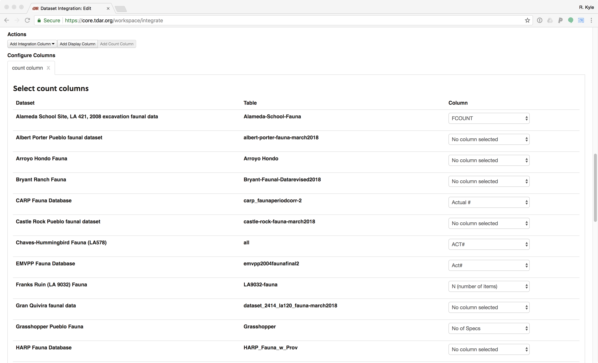
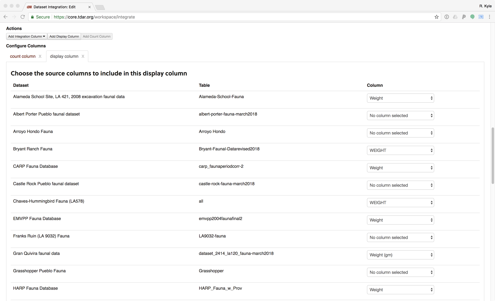
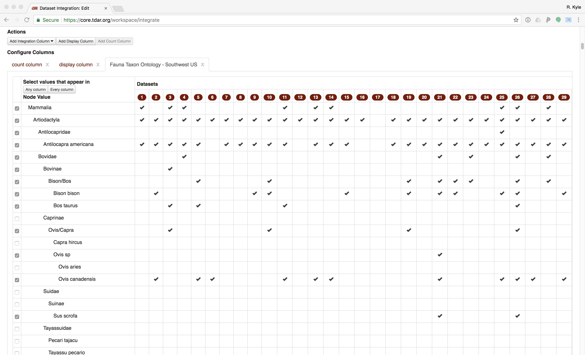
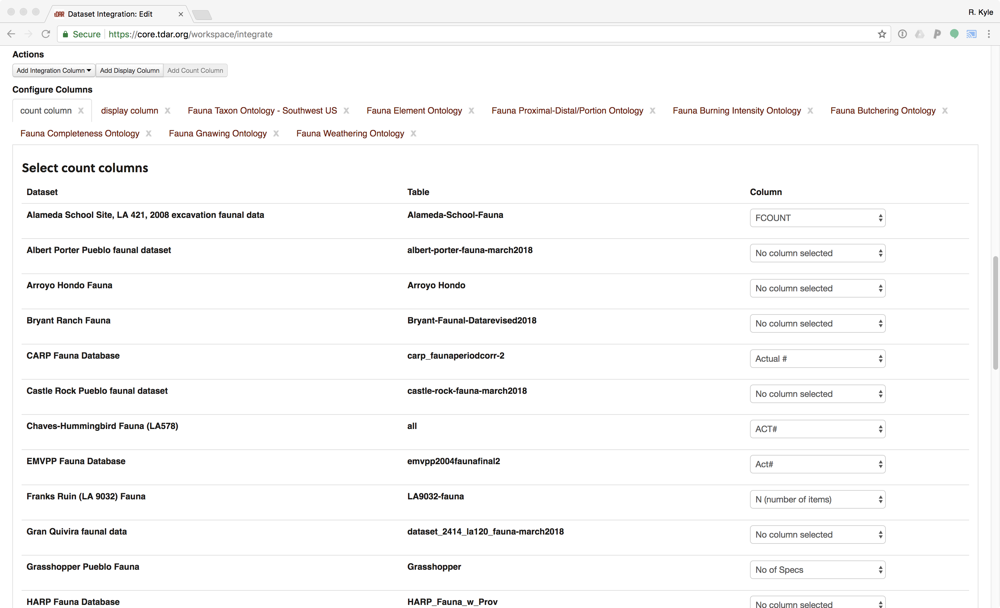

```{r setup, echo = FALSE, warning = FALSE, message = FALSE, error = FALSE, collapse=TRUE, cache=FALSE, results = 'hide'}
# Load the package for this vignette
library(swtp)

# Set the behavior for printing scientific notation
options(digits = 3, 
        scipen = -2)

# Set the knitting behavior
knitr::opts_chunk$set(echo = FALSE,
                      warning = FALSE,
                      message = FALSE,
                      error = FALSE,
                      collapse = TRUE, 
                      results = 'hold',
                      cache = FALSE,
                      out.width = "100%",
                      fig.height = 5
)

# A function that summarizes the data for a variable by dataset
var_summary <- function(x, var){
  quo_var <- rlang::enquo(var)
  x %>%
    dplyr::select(Dataset, !!quo_var) %>%
    dplyr::group_by(Dataset, !!quo_var) %>%
    dplyr::count() %>%
    dplyr::group_by(Dataset) %>%
    tidyr::spread(!!quo_var,
                  n,
                  drop = FALSE) %>%
    dplyr::mutate_all(.funs = function(x){
      ifelse(is.na(x), 0, x)
    }) %>%
    dplyr::ungroup()
}

# A function to further summarize variable data
affected_summary <- function(x, ...){
  affected_var <- rlang::quos(...)
  
  x %>%
    dplyr::mutate(
      `n total` = rowSums(
        dplyr::select(.,
                      -Dataset)
      ) %>%
        as.integer(),
      `n recorded` = rowSums(
        dplyr::select(.,
                      -Dataset,
                      -`Not Recorded`,
                      -MISSING,
                      -`NULL`,
                      -UNMAPPED,
                      -Indeterminate)
      ) %>% 
        as.integer(),
      `p recorded` = `n recorded` / `n total`,
      `n affected` = rowSums(
        dplyr::select(.,
                      !!!affected_var)
      ) %>% 
        as.integer(),
      `p affected` = `n affected`/`n recorded`,
      `p affected CI lower` = purrr::map2_dbl(`n affected`,
                                              `n recorded`,
                                              function(x,y){
                                                ifelse(y > 0, 
                                                       binom.test(x,y)$conf.int[[1]],
                                                       NA)
                                              }),
      `p affected CI upper` = purrr::map2_dbl(`n affected`,
                                              `n recorded`,
                                              function(x,y){
                                                ifelse(y > 0, 
                                                       binom.test(x,y)$conf.int[[2]],
                                                       NA)
                                              })
    ) %>%
    dplyr::select(Dataset,
                  `n total`,
                  `n recorded`,
                  `p recorded`:`p affected CI upper`)
  
}

# Thresholds for inclusion used in this study
apply_thresholds <- function(x){
  x %>%
    dplyr::mutate(`p affected` = ifelse(!(`n total` >= 25 & 
                                            `p recorded` >= 0.4), 
                                        NA, 
                                        `p affected`),
                  `p affected CI lower` = ifelse(!(`n total` >= 25 & 
                                                     `p recorded` >= 0.4), 
                                                 NA, 
                                                 `p affected CI lower`),
                  `p affected CI upper` = ifelse(!(`n total` >= 25 & 
                                                     `p recorded` >= 0.4), 
                                                 NA, 
                                                 `p affected CI upper`))
}

# A plotting function for the summary data
plot_summary <- function(x){
  (x %>% 
     dplyr::arrange(-`p affected`,`p affected CI lower`) %>%
     ggplot2::ggplot(mapping = ggplot2::aes(x = Dataset %>%
                                              reorder(-`p affected CI lower`) %>%
                                              reorder(-`p affected`),
                                            y = `p affected`,
                                            text = paste0(Dataset,"\n",
                                                          "Taxon NISP recorded: ", `n recorded`,"\n",
                                                          "Prop. affected: ", `p affected` %>% 
                                                            round(digits = 3),"\n"
                                            ))) +
     ggplot2::geom_pointrange(ggplot2::aes(ymin = `p affected CI lower`,
                                           ymax = `p affected CI upper`)) +
     ggplot2::xlab("") +
     ggplot2::ylab("Proportion Affected") +
     # coord_flip() +
     ggplot2::theme(legend.position = "none",
                    axis.text.x = ggplot2::element_text(angle = 90,
                                                        hjust = 1,
                                                        vjust = 0.5))) %>%
    plotly::ggplotly(tooltip = "text") %>%
    plotly::config(displaylogo = F,
                   scrollZoom = F,
                   collaborate = FALSE,
                   modeBarButtonsToRemove = list("toggleSpikelines",
                                                 "hoverClosestCartesian",
                                                 "hoverCompareCartesian",
                                                 "resetScale2d",
                                                 "select2d",
                                                 "lasso2d")) %>% 
    plotly::layout(margin = list(b=150, l=50))
}


# A function that creates a table in a standard format used
# in this report
tabler <- function(x, 
                   title = "SWTP_Table"){
  x %>%
    dplyr::mutate_if(is.double, ~round(., digits = 3)) %>%
    DT::datatable(style = "bootstrap",
                  extensions = c('FixedColumns', 'Buttons'),
                  options = list(
                    dom = '<"top"lf<"clear">>rt<"bottom"ipB<"clear">>',
                    buttons = htmlwidgets::JS(paste0("[{extend: 'csvHtml5',title: '",title,"'},{extend: 'print',autoPrint: false}]")),
                    scrollX = TRUE,
                    fixedColumns = list(leftColumns = 1),
                    pageLength = 5),
                  rownames = FALSE)
}

```

# Introduction

* Understanding taphonomy important for analysis and interpretation of faunal assemblages
* Common "language" of taphonomy essential for inter-site or inter-project comparisons
* Taphonomic processes of course context-specific, but regionally-important processes may be identified
* Here, we apply the *Southwestern Taphonomic Protocol*, a systematic way to compare taphonomic impacts on faunal assemblages across archaeological sites in the southwestern US

## Project Description
This paper was developed out of the NSF-funded project *Faunal Resource Depression and Intensification in the North American Southwest: Digital Data and Regional Synthesis* (BCS-1153115). The project's primary objective was to examine whether there was a relationship between the reduction in availability of large game and the intensification of turkey production in the late pre-Hispanic period (1200--1500 CE) in the American Southwest. Addressing this topic required access to and the integration of multiple faunal data sets from Ancestral Pueblo sites dating to that time period. During the project these data sets were uploaded into tDAR (the Digital Archaeological Record, [tdar.org](https://www.tdar.org/)), providing both the project personnel and the public access to the data. The collection of faunal data sets curated during this project are available in the [*Archaeological Fauna: US Southwest* collection on tDAR](https://core.tdar.org/collection/16056/archaeological-fauna-us-southwest). A subset of these data sets which had sufficient sample sizes for the taxa of interest, was selected for the taphonomic analysis, and are available in the [*Southwestern Taphonomic Protocol* collection on tDAR](https://core.tdar.org/collection/68928/the-southwestern-taphonomic-protocol); those are the thirty-two data sets reported on here.

Given that these assemblages had been analyzed and recorded by multiple faunal analysts with different coding schemes, an integrated analysis required that their variables be mapped to a set of general ontologies. This mapping was made possible by the development of such ontologies within tDAR. New software within tDAR then allowed the integrated analysis of these datasets (see @Kintigh2018 for details on this component of the project).

Inter-site comparative analyses of the fauna data also necessitated an examination of the degree to which the zooarchaeological remains from these different sites had been affected by taphonomic processes [@Bar-Oz2003;  @Gifford1981; @Lyman1994; @Lyman2010]. To assess variability in taphonomic history, Tiffany Clark -@Clark2014 developed a protocol that explores the degree to which different taphonomic factors played a role in assemblage formation. At the end of her portion of the project, we were concerned by the challenge of undertaking analyses of the diversity of taphonomic variables that were included in the protocol. Kyle Bocinsky thus joined the project to help develop this executable paper for the protocol so that it can be routinely used, or modified as necessary, by other researchers interested in the integrated analysis of faunal data. @Clark2014 contains details regarding the development of the protocol.

## Overview of Paper
The remainder of this paper briefly discusses the development of the taphonomic protocol and executes it on the 32 faunal data sets included as part of our project. This document is an R Markdown document --- essentially, it is a text file that includes computer code in the R statistical language that runs all of the analyses discussed here and produces the figures and tables in this document. The HTML or PDF version of this paper (which you are probably reading) is “compiled” from that original text document and related data files, which were developed at https://github.com/bocinsky/swtp and are archived at [ZENODO ARCHIVE URL HERE]. R Markdown allows for dynamic, data-driven analysis and report writing, and fosters reproducible research. As such, we hope that this document will not only serve as an introduction to the Southwestern Taphonomic Protocol, but will also be a template for others’ implementations of (or alterations to) it; we are currently developing an interactive tool to allow researchers to analyze their own data without having to change the R code. Details on using R Markdown can be found at http://rmarkdown.rstudio.com. The executable paper attempts to follow guidelines developed by Ben Marwick -@Marwick2017 for practicing reproducible computing in archaeological research, and was developed using the [*rrtools*](https://github.com/benmarwick/rrtools) package for R [@rrtools].

-----

# Overview of SWTP

## Selection of Variables and Quantification Method
The first step in constructing the taphonomic protocol was to identify the variables that could be used to assess the impact of different natural and cultural processes on assemblage formation. Data from the analysis of these variables could then be used to evaluate the relative degree of taphonomic comparability among assemblages and to identify individual data sets (or components therein) that display substantial taphonomic bias. A review of the literature found that a diversity of attributes has been employed to evaluate taphonomic biases in faunal assemblages [@Bar-Oz2003; @Bar-Oz2004; @Behrensmeyer1991; @Lyman1984; @Lyman1985; @Lyman1994; @Marean1991; @Morlan1994; @Pickering2003; @Orton2012; @Stiner1992; @Stiner1994]. Although much of this research has focused on examining a single or small set of variables (e.g., density-mediated attrition or fragmentation), several recent studies have sought to provide a more integrated approach to the study of faunal taphonomy [see @Bar-Oz2004; @Marciniak2001; @Marciniak2005; and @Orton2012]. These analytical schemes incorporate numerous variables in order to evaluate the effects that different taphonomic agents may have had on faunal assemblages.

The relatively comprehensive sets of variables that were employed by @Bar-Oz2004 provided a basis with which to begin to define the attributes that are most appropriate for the SWTP. However, those authors caution that the influence and combination of taphonomic factors that affect assemblages may differ significantly among time periods and across geographic regions, and as such it is important that researchers evaluate the suitability of individual taphonomic variables to address their specific data sets and research questions. Towards this end, @Clark2014 identified a subset of the variables evaluated by @Bar-Oz2004 that appeared to be most applicable to the examination of taphonomic processes in the pre-Hispanic Southwest. The variables that were selected could be evaluated using data that are commonly recorded on Southwestern sites by zooarchaeologists and had the potential not only to inform on natural agents involved in assemblage formation, but also on the degree of influence of various anthropogenic factors. 

The variables fell into three broad analytical categories: bone surface modification, fragmentation intensity, and assemblage completeness. In this paper, these variables are compared across the three taxonomic categories that are relatively abundant in Southwestern assemblages and are of particular interest to the large game depletion/turkey intensification portion of this project: artiodactyls, lagomorphs, and turkey. Table 1 provides a list of the variables used in the protocol. Analyses assessing these variables have the potential not only to inform on the natural agents (weathering, gnawing, density-mediated attrition, and in situ attrition) that were involved in assemblage formation, but also on the degree of influence of anthropogenic factors involved in processing a carcass. A short description of each variable, including its interpretative potential and means of assessment, is provided below.

{#tab:taphonomic_variables}
<caption>Table: (#tab:taphonomic_variables) List of possible taphonomic variables</caption>
Variable | Potential Taphonomic Information
------------------------------------ | -----------------------------------------------
Proportion of weathering of artiodactyl bone (NISP) | Damage from natural peri-depositional formation processes
Proportion of gnawing on artiodactyl bone (NISP) | Damage from natural peri-depositional formation processes
Proportion of burning of artiodactyl bone (NISP) | Damage by human subsistence behaviors
Proportion of cut marks on artiodactyl bone (NISP) | Damage by human subsistence behaviors
Degree of completeness of artiodactyl bone (NISP) | Fragmentation from both natural and cultural agents
Artiodactyl average bone weight (grams) | Fragmentation from both natural and cultural agents
Proportion of complete astragals (NISP) | *In situ* attrition
Relationship between bone survivorship (NISP) and bone mineral density | Density-mediated attrition
Frequency of burning of artiodactyl, lagomorph, and turkey bone (NISP) | Intertaxonomic differences in damage by human subsistence behaviors
Frequency of cut marks on artiodactyl, lagomorph, and turkey bone (NISP) | Intertaxonomic differences in damage by human subsistence behaviors
Degree of bone completeness for artiodactyls, lagomorphs, and turkeys (NISP) | Intertaxonomic differences in natural and cultural agents
Bone survivorship (NISP) and bone mineral density of artiodactyls, lagomorphs, and turkeys | Intertaxonomic differences in natural and cultural agents

During the development of the protocol [@Clark2014], although the Number of Identified Specimens (NISP) was used as the primary method of quantification, the Minimum Number of Individuals (MNI) was also calculated for select variables. Analyses of bone survivorship were undertaken using both NISP and MNI counts in order to evaluate the comparability of the results obtained with different quantification methods; both methods produced similar Spearman’s rank correlation coefficient values. These results suggest that in most cases, NISP counts can effectively be employed to assess the relationship between bone survivorship and bone mineral density. This conclusion supports the earlier findings by @Grayson2004, who determined that NISP-based body-part analyses could replicate the results of those obtained using derivative counting methods including MNI, MNE (Minimum Number of Elements), and MAU (Minimal Animal Unit). The NISP requires minimal time to calculate, can be easily replicated, and avoids the problems associated with the use of MNI counts on small-sized assemblages (see discussion in Grayson -@Grayson2014). NISP is thus the quantification method used in the execution of the taphonomic protocol in this paper. 

The final step in the development of the protocol was the delineation of the quantitative methods that may be used to gain a comparative understanding of how the taphonomic variables patterned across different sites. To this end, it was decided that in most cases, a visual assessment of the quantitative data was the most effective means for assessing taphonomic data across sites and for identifying those assemblages that may have been subject to taphonomic processes significantly different from the others. One of the strengths of this approach is that it allows the researcher to easily identify how, and to what extent, an assemblage may have been taphonomically altered. Based on this information, a researcher can determine whether or not an assemblage displays enough of a taphonomic bias to warrant its exclusion from a particular study. For the analysis of the degree of correlation between element representation and bone mineral density we used Spearman’s rank correlation coefficient, rho. For the rho data, we assessed both the numeric output and the graph. We bootstrap-estimated 95% confidence intervals around Spearman’s rho. In the graphs below, the dot denotes Spearman’s rho, while the line denotes the bootstrapped 95% confidence interval.

To visually compare the distribution of taphonomic data by variable, the proportion of each assemblage affected and the 95 percent confidence interval around the proportion are calculated in this paper. The dot denotes the proportion of each assemblage affected, with the black line indicating the error range at a 95 percent confidence level estimated using an exact binomial test [@Clopper1934]. The width of the confidence intervals can be used to assess the accuracy of the estimated proportion and the degree of confidence associated with the estimate. Narrow confidence intervals are often associated with large samples that display a low degree of variance; in contrast, wider confidence intervals tend to reflect more heterogeneous samples or samples that are relatively small in size. The use of the confidence intervals also allows the analyst to determine whether differences among assemblages are the result of taphonomic bias or are more likely attributable to sampling error.

-----

# Analysis and Discussion
## Data overview
Data reported here are derived from publicly available faunal data sets from single-site contexts, some from single site contexts others from several sites within a local area. For the purpose of this paper, we chose *not* to assess taphonomic processes through time or to compare sites within data sets or proveniences within sites (though the SWTP can be used for both). Data sets were uploaded to tDAR either by the original faunal analysts or by project team members.

In several cases, including the Mesa Verde (Crow Canyon) and Salinas data sets, a single variable included multiple kinds of taphonomic data (e.g., burning, weathering, and gnawing). In order to include those sites in the taphonomic assessment we decided to disaggregate these data by creating additional variables in a copy of each data set. These copies are also available on tDAR but do not replace the original data sets there. The caveat to this approach is that since only one of the several taphonomic conditions coded in a single variable could have been selected in the original analysis, elements that exhibited more than one condition would have had only one coded. (For example, Crow Canyon’s faunal database includes three modification columns, limiting the number of possible individual codes to three). **This means that the results of the calculations undertaken in the executable paper are the minimum proportion of bones that were affected by a taphonomic condition for that site.** We recommend future analyses code each type of taphonomic condition separately, preferably using a regionally-appropriate ontology such as the ontologies defined as part of the [*Archaeological Fauna: US Southwest* collection on tDAR](https://core.tdar.org/collection/16056/archaeological-fauna-us-southwest?selectedResourceTypes=ONTOLOGY&startRecord=0).

In a few other cases a single taphonomic variable in our analysis was coded across multiple variables. For example, the Bryant Ranch faunal dataset includes separate columns for rodent gnawing and carnivore gnawing; we combined these into a new column mapped to the tDAR Faunal Gnawing Ontology. This was rare, but when it occurred we made a duplicate of the data set in tDAR and created a new synthetic variable that could be mapped to the ontology for that variable. Again, the original data set in tDAR remains intact.

### The tDAR integration tool
Once the data sets were uploaded to tDAR and their relevant variables mapped (by the original analyst or project personnel) to the general ontologies in tDAR, we combined them using tDAR's integration tool [@Kintigh2018]. Integrations use contributor-defined mappings between variable codings in the original data sets and community-defined ontologies to combine data sets with otherwise mutually incompatible categories. The tDAR integration tool is a robust and mature system for combining data sets hosted on tDAR; it allows users to select multiple data sets, choose mutually-mapped ontologies to include in the integration, and export data for further analysis and to share with colleagues.

```{r get-tdar-integration, results='hide'}
integration_xlsx <- "../data/raw_data/tdar-integration-SWTP-6.xlsx"

tdar::tdar_login()

integration.data <- 
  integration_xlsx %>%
  # Read the integration data into R
  readxl::read_excel(col_types = "text") %>%
  # Remove blank rows
  dplyr::filter(!is.na(`Dataset/Table Name`)) %>% 
  dplyr::mutate(`Dataset/Table Name` = factor(`Dataset/Table Name`)) %>%
  # Rename "display column" to "Weight"
  dplyr::rename(Weight = `display column`) %>%
  dplyr::mutate(Weight = as.numeric(Weight),
                Weight = ifelse(Weight == 0, NA, Weight)) %>%
  # Set the count column to 1 if NA, otherwise don't change
  dplyr::mutate(count = as.character(`count column`),
                count = dplyr::if_else(is.na(count) | count == ".", "1.0", count),
                count = as.integer(count)) %>%
  # Repeat rows with more than observation per record
  dplyr::slice(rep(1:n(),times = count)) %>%
  # Remove count column (it is no longer meaningful)
  dplyr::select(-`count`,
                -`count column`) %>%
  # Drop the sort columns; we will get sort orders from ontologies
  dplyr::select(`Dataset/Table Name`,
                Weight,
                dplyr::contains("mapped-"))

# Turn ontological variables into trees
for(variable in names(integration.data)){
  if(!variable %>% stringr::str_detect("mapped-"))
    next
  
  ontology <- variable %>%
    stringr::str_extract("\\d+") %>%
    as.integer()
  
  integration.data[[variable]] <- 
    treecats::tct_tree(integration.data[[variable]],
                       tct_levels = tdar::tdar_get_ontology(ontology)) %>%
    forcats::fct_expand("Not Recorded",
                        "MISSING",
                        "UNMAPPED",
                        "NULL") %>%
    forcats::fct_relevel("Not Recorded",
                         "MISSING",
                         "UNMAPPED",
                         "NULL",
                         after = Inf)
}

tdar::tdar_logout()
```

```{r process-tdar-integration}

names(integration.data) <- names(integration.data) %>%
  stringr::str_remove_all("mapped-") %>%
  stringr::str_remove_all("\\(.*")

# Rename variables to something nicer
integration.data %<>%
  dplyr::rename(Dataset = `Dataset/Table Name`,
                Taxon = `Fauna Taxon - Southwest US`,
                Element = `Fauna Element`,
                `Proximal/distal` = `Fauna Proximal-Distal/Portion`,
                Weathering = `Fauna Weathering`,
                `Burning` = `Fauna Burning Intensity`,
                Gnawing = `Fauna Gnawing`,
                Completeness = `Fauna Completeness`,
                Butchering = `Fauna Butchering`)

datasets <- integration_xlsx %>%
  # Read the integration data into R
  readxl::read_excel(sheet = "Description",
                     skip = 2,
                     n_max = 2,
                     col_names = FALSE,
                     col_types = "text") %>%
  as.matrix() %>%
  t() %>%
  na.omit() %>%
  tibble::as_tibble() %>%
  magrittr::set_names(c("tDAR ID", 
                        "Dataset (Long)")) %>%
  dplyr::mutate(`tDAR ID` = `tDAR ID` %>%
                  stringr::str_extract("[^(]+$") %>%
                  stringr::str_remove("[)]") %>%
                  stringr::str_remove(","),
                `Dataset (Long)` = factor(`Dataset (Long)`))


# OPTIONAL: Rename datasets
integration.data %<>%
  dplyr::mutate(`Dataset (Long)` = Dataset,
                Dataset = forcats::fct_relabel(`Dataset (Long)`, ~ stringr::str_remove(.x, " Fauna - .*"))) %>%
  dplyr::left_join(datasets,
                   by = "Dataset (Long)")

# Order columns
integration.data %<>%
  dplyr::select(Dataset,
                # `Dataset (Long)`,
                `tDAR ID`,
                Taxon,
                Element,
                `Proximal/distal`,
                Weight,
                Burning,
                Butchering,
                Completeness,
                Gnawing,
                Weathering)

```

```{r write-tdar-integration, cache=FALSE}

integration.data %T>%
  readr::write_csv("../data/derived_data/tdar-integration-SWTP_final.csv") %>%
  readr::write_rds("../data/derived_data/tdar-integration-SWTP_final.Rds", 
                   compress = "bz")

```

As part of this project, team members defined 20 ontologies including various taphonomic variables, which we used to integrate the 32 data sets in this analysis. We included ontologies for taxon, element, proximal/distal portion, burning intensity, butchering, completeness, gnawing, and weathering, plus a "count" column for recording NISP and a "display" column for recording weight. In some data sets each line represented a single element, in others there was a “count” column that can be identified as such in tDAR.

When adding a "count" column (Figure \@ref(fig:tdar-instructions-count)), we selected the mapped variables that corresponded to NISP (as opposed to MNI). In most cases, this meant selecting "Actual #", "N", or a variation. 

```{r tdar-instructions-count, fig.cap='Screen capture of the tDAR integration tool count column selector. Users have to manually select the appropriate "count" variable, if one exists, to represent NISP.'}

```

We then added a "display" column for weight (Figure \@ref(fig:tdar-instructions-weight)), and selected the appropriate column for every data set in which specimen weight was recorded.

```{r tdar-instructions-weight, fig.cap='Screen capture of the tDAR integration tool display column selector, showing selected weight variables where available.'}

```

We then added integration columns (Figure \@ref(fig:tdar-instructions-taxon)). The tDAR integration tool allows the user to select categories within each ontology to be included in the integration, potentially collapsing lower-order categories into higher-order ones. For our analysis, however, we chose to handle the collapsing within R (and this script) so as to have better control over collapsed categories. Therefor, when adding integration columns, users of the SWTP should click the "Select values that appear in **any column**" button in the left hand column. This will select the check boxes for categories represented in **any** of the integrated datasets.

```{r tdar-instructions-taxon, fig.cap='Screen capture of the tDAR integration tool integration column selector. For integration columns in our analysis, users should click the "Select values that appear in **any column**" button in the left hand column.'}

```

Once all integration columns are selected (Figure \@ref(fig:tdar-instructions-all)), we requested the tDAR servers to process the integration. Due to the large amount of data in these datasets, the integrations timed out and we had to request the integration output from the tDAR staff directly. We archived the raw output from our final tDAR integration on tDAR as well: [ADD TDAR ARCHIVE URI HERE]. 

```{r tdar-instructions-all, fig.cap='Screen capture of the tDAR integration tool showing the count, display, and integration columns.'}

```

### Collapsing taxon data into artiodactyls, lagomorphs, and turkeys
The SWTP focuses on three taxonomic categories: artiodactyls, lagomorphs, and turkeys. Given that many datasets had identified taxa to more specific levels than order, we developed a new package for R called [*treecats*](https://github.com/bocinsky/treecats) that manipulates tree-like categorical data such as the tDAR ontologies and enables users to collapse nested categories in a comprehensive and reproducible way. While the tDAR integration tool allows for collapsing ontologies, it currently depends on the user selecting the appropriate higher-order check boxes, a process that in our experience was tedious and perhaps too error prone to be sufficiently reproducible.

We collapsed all species in the taxonomic order Artiodactyla, all the species in the taxonomic order Lagomorpha, and included any avian remains categorized as "large aves" in *Meleagris gallopavo*. Our goal was to conform to established precedent in southwestern archaeology, while using sufficiently broad taxonomic classes so as to account for analyst error. Although it is somewhat common in the Southwest to include "large mammal" in analyses involving artiodactyl fauna, we did not include large mammal counts in this analysis because some datasets only included identified fauna and not elements from this more general category. Thus the results of our calculations would have been incommensurate across sites if large mammal counts were included.

```{r collapse-taxa}
integration.data %<>%
  dplyr::mutate(Taxon = Taxon %>%
                  treecats::tct_collapse("Artiodactyla") %>%
                  treecats::tct_collapse("Lagomorpha") %>%
                  forcats::fct_recode("Meleagris gallopavo" = "large aves"),
                Weathering = Weathering %>%
                  treecats::tct_collapse("Weathered"),
                Burning = Burning %>%
                  treecats::tct_collapse("Burned"),
                Gnawing = Gnawing %>%
                  treecats::tct_collapse("Gnawed"), 
                Butchering = Butchering %>%
                  treecats::tct_collapse("Butchered")
  )

```

### Thresholds for dataset inclusion
In the initial stages of developing this executable paper we found that there were assemblages in which relevant variables were present, but rarely used, or where sample sizes were far too small to result in meaningful information. Particularly in the case of the rare use of a variable, calculations of proportions and confidence intervals resulted in potentially spurious output. We thus established thresholds for inclusion of variables in the taphonomic protocol that would preclude their calculation where results would be misleading. The threshold for inclusion of artiodactyls, lagomorphs, or turkey elements in a calculation was set at an NISP of 25 for each taxonomic category. For the third phalange or astragal to be included there needed to be a minimum of 5 for the element under consideration. For any assemblage to be included in the analysis of a variable, a minimum of 40 percent of the assemblage had to have been coded for that variable.

Related to thresholds, a number of assemblages used the coding option of "indeterminate." While this meant that the variable was indeed coded for all of the cases, the actual content of that coding did not contribute information to the interpretation of how prevalent the taphonomic condition was in that assemblage. We thus chose to consider those cases uncoded for analyzing taphonomic differences across sites. Therefore sites with more than 60 percent of the cases coded as "indeterminate" fell below the minimum of threshold of 40 percent coded and were not included in the calculation of that variable.

### Data overview
This table summarizes the data sets, including the counts of samples with valid measurements across each variable reviewed in the Southwest Taphonomic Protocol.

```{r data-overview, results='markup'}
data_overview <- integration.data %>%
  dplyr::group_by(Dataset,
                  `tDAR ID`) %>%
  dplyr::summarise(
    `Total NISP` = n(),
    `Art. NISP` = sum(Taxon %in% c("Artiodactyla")),
    `Lag. NISP` = sum(Taxon %in% c("Lagomorpha")),
    `Meg. NISP` = sum(Taxon %in% c("Meleagris gallopavo")),
    `Burning` = sum(!(`Burning` %in% c("Not Recorded","NULL","MISSING","UNMAPPED","Indeterminate"))),
    `Butchering` = sum(!(`Butchering` %in% c("Not Recorded","NULL","MISSING","UNMAPPED","Indeterminate"))),
    `Completeness` = sum(!(`Completeness` %in% c("Not Recorded","NULL","MISSING","UNMAPPED","Indeterminate"))),
    `Gnawing` = sum(!(`Gnawing` %in% c("Not Recorded","NULL","MISSING","UNMAPPED","Indeterminate"))),
    `Weathering` = sum(!(`Weathering` %in% c("Not Recorded","NULL","MISSING","UNMAPPED","Indeterminate")))
  )

# knitr::kable(data_overview, caption = "tester.")

tabler(data_overview, "SWTP_Overview")

```

### Dataset and variable inclusion after thresholding (“Table 3”)

## Bone surface modification {.tabset .tabset-fade .tabset-pills}
### Burning {- .tabset .tabset-dropdown}
Proportion of assemblage showing evidence of burning
: Burning is often a result of food preparation or refuse disposal practices and as such, can be an important cultural agent in assemblage formation. However, because burning renders bones more susceptible to fragmentation [@Stiner1995], this variable may also provide insight into post-depositional processes. Burning is assessed by calculating the proportion of specimens (NISP) in the artiodactyl, lagomorph, and *Meleagris gallopavo* assemblages showing signs of exposure to heat (e.g., partial charring, charring, or calcined); these were mapped to "Burned" or "Probably Burned" in the [SWUS Fauna Burning Intensity Ontology](http://core.tdar.org/ontology/3443/fauna-burning-intensity-ontology).

**Select a taxon to view its burning data:**

```{r burning}
burning <- function(taxon){
  integration.data %>%
    dplyr::filter(Taxon %in% taxon) %>%
    var_summary(`Burning`) %>%
    affected_summary(Burned, `Probably Burned`) %>%
    apply_thresholds()
}
```

#### Artiodactyla {-}
```{r art-burning}
out <- "Artiodactyla" %>%
  burning()

tabler(out, "SWTP_Artiodactyla_Burning")
plot_summary(out)
```

#### Lagomorpha {-}
```{r lag-burning}
out <- "Lagomorpha" %>%
  burning()

tabler(out, "SWTP_Lagomorpha_Burning")
plot_summary(out)
```

#### Meleagris gallopavo {-}
```{r meg-burning}
out <- "Meleagris gallopavo" %>%
  burning()

tabler(out, "SWTP_Meleagris_Burning")
plot_summary(out)
```

### Butchering {.tabset .tabset-dropdown}
Proportion of assemblage showing butchering marks
: The occurrence cut marks in a faunal assemblage may directly inform on butchering practices and processing techniques. The analysis of cut marks is used in the taphonomic study to evaluate the extent of damage resulting from human subsistence behavior. This variable is assessed by calculating the proportion of specimens (NISP) in the artiodactyl, lagomorph, and *Meleagris gallopavo* assemblages that show evidence of butchering or cut marks; these were mapped to "Butchered" or "Probably Butchered" in the [SWUS Fauna Butchering Ontology](http://core.tdar.org/ontology/3989/fauna-butchering-ontology).

**Select a taxon to view its butchering data:**

```{r butchering}
butchering <- function(taxon){
  integration.data %>%
    dplyr::filter(Taxon %in% taxon) %>%
    var_summary(`Butchering`) %>%
    affected_summary(Butchered,
                     `Probably Butchered`) %>%
    apply_thresholds()
}
```

#### Artiodactyla {-}
```{r art-butchering}
out <- "Artiodactyla" %>%
  butchering()

tabler(out, "SWTP_Artiodactyla_Butchering")
plot_summary(out)
```

#### Lagomorpha {-}
```{r lag-butchering}
out <- "Lagomorpha" %>%
  butchering()

tabler(out, "SWTP_Lagomorpha_Butchering")
plot_summary(out)
```

#### Meleagris gallopavo {-}
```{r meg-butchering}
out <- "Meleagris gallopavo" %>%
  butchering()

tabler(out, "SWTP_Meleagris_Butchering")
plot_summary(out)
```


### Gnawing {.tabset .tabset-dropdown}
Proportion of assemblage showing evidence of gnawing
: The extent of rodent and carnivore gnawing in an assemblage may provide direct information regarding peri-depositional formation processes. This variable is assessed by calculating the proportion of specimens (NISP) in the artiodactyl, lagomorph, and *Meleagris gallopavo* assemblages that were mapped to "Gnawed" in the [SWUS Fauna Gnawing Ontology](http://core.tdar.org/ontology/3033/fauna-gnawing-ontology).

**Select a taxon to view its gnawing data:**

```{r gnawing}
gnawing <- function(taxon){
  integration.data %>%
    dplyr::filter(Taxon %in% taxon) %>%
    var_summary(`Gnawing`) %>%
    affected_summary(Gnawed) %>%
    apply_thresholds()
}
```

#### Artiodactyla {-}
```{r art-gnawing}
out <- "Artiodactyla" %>%
  gnawing()

tabler(out, "SWTP_Artiodactyla_Gnawing")
plot_summary(out)
```

#### Lagomorpha {-}
```{r lag-gnawing}
out <- "Lagomorpha" %>%
  gnawing()

tabler(out, "SWTP_Lagomorpha_Gnawing")
plot_summary(out)
```

#### Meleagris gallopavo {-}
```{r meg-gnawing}
out <- "Meleagris gallopavo" %>%
  gnawing()

tabler(out, "SWTP_Meleagris_Gnawing")
plot_summary(out)
```


### Weathering {.tabset .tabset-dropdown}
Proportion of assemblage showing evidence of weathering
: The extent of weathering within an assemblage may provide direct information regarding peri-depositional formation processes. Weathering is assessed by calculating the proportion of specimens (NISP) in the artiodactyl, lagomorph, and *Meleagris gallopavo* assemblages that were mapped to "Weathered" in the [SWUS Fauna Weathering Ontology](http://core.tdar.org/ontology/3032/fauna-weathering-ontology).

**Select a taxon to view its weathering data:**

```{r weathering}
weathering <- function(taxon){
  integration.data %>%
    dplyr::filter(Taxon %in% taxon) %>%
    var_summary(`Weathering`) %>%
    affected_summary(Weathered) %>%
    apply_thresholds()
}
```

#### Artiodactyla {-}
```{r art-weathering}
out <- "Artiodactyla" %>%
  weathering()

tabler(out, "SWTP_Artiodactyla_Weathering")
plot_summary(out)

```

#### Lagomorpha {-}
```{r lag-weathering}
out <- "Lagomorpha" %>%
  weathering()

tabler(out, "SWTP_Lagomorpha_Weathering")
plot_summary(out)
```

#### Meleagris gallopavo {-}
```{r meg-weathering}
out <- "Meleagris gallopavo" %>%
  weathering()

tabler(out, "SWTP_Meleagris_Weathering")
plot_summary(out)
```


## Fragmentation intensity {.tabset .tabset-fade .tabset-pills}
### Fragmentation {.tabset .tabset-dropdown}
Proportion of assemblage that is highly fragmented
: The proportion of highly fragmented bone can be used to evaluate the overall degree of fragmentation among assemblages. As noted by Todd and Rapson [-@Todd1988,pp. 33--35], a variety of different processes may result in the higher amounts of fragmentation elements within an assemblage. These may include pre-depositional factors related to grease and marrow extraction activities or post-depositional damage resulting from overburden/sedimentary compaction or trampling. The degree of fragmentation of artiodactyl, lagomorph, and *Meleagris gallopavo* bone was assessed in this study by calculating the proportion of bone within each assemblage that was less than 25 percent complete; these were mapped to "<25%" in the [SWUS Fauna Completeness Ontology](http://core.tdar.org/ontology/376370/fauna-completeness-ontology).

**Select a taxon to view its fragmentation data:**

```{r fragmentation}
fragmentation <- function(taxon){
  integration.data %>%
    dplyr::filter(Taxon %in% taxon) %>%
    var_summary(`Completeness`) %>%
    affected_summary(`<25%`) %>%
    apply_thresholds()
}
```

#### Artiodactyla {-}
```{r art-fragmentation}
out <- "Artiodactyla" %>%
  fragmentation()

tabler(out, "SWTP_Artiodactyla_Fragmentation")
plot_summary(out)

```

#### Lagomorpha {-}
```{r lag-fragmentation}
out <- "Lagomorpha" %>%
  fragmentation()

tabler(out, "SWTP_Lagomorpha_Fragmentation")
plot_summary(out)
```

#### Meleagris gallopavo {-}
```{r meg-fragmentation}
out <- "Meleagris gallopavo" %>%
  fragmentation()

tabler(out, "SWTP_Meleagris_Fragmentation")
plot_summary(out)
```


### Weight{.tabset .tabset-dropdown}
Bone weight
: There is a broad correlation between fragment size, count, and weight [@Lyman2008, pp. 102--103]. Calculating the median bone weight for taxa can provide a means for evaluating the degree of fragmentation associated with a specific assemblage. Here, we show the mean, median, and interquartile range (IQR) of bone weights. In the graph below, the closed circles represent the medians, and the open circles represent the means. Unsurprisingly, the weight distributions are universally right skewed, with low numbers of heavier elements increasing the mean well above the median bone weight.
```{r bone-weight}
bone_weight <- function(taxon){
  integration.data %>%
    dplyr::filter(Taxon %in% taxon) %>%
    dplyr::group_by(Dataset) %>%
    dplyr::summarise(
      `n taxon` = n(),
      `n weight recorded` = sum(!is.na(Weight)),
      `Weight (mean)` = mean(Weight, na.rm = T) %>% 
        round(digits = 1),
      `Weight (median)` = median(Weight, na.rm = T) %>% 
        round(digits = 1),
      `Weight (IQR—lower)` = quantile(Weight,
                                      probs = 0.25, 
                                      na.rm = T) %>% 
        round(digits = 1),    
      `Weight (IQR—upper)` = quantile(Weight,
                                      probs = 0.75, 
                                      na.rm = T) %>% 
        round(digits = 1)
    )
}

bone_weight_plot <- function(x){
  (x %>%
     dplyr::arrange(-`Weight (median)`) %>%
     ggplot2::ggplot(mapping = ggplot2::aes(x = Dataset %>%
                                              reorder(-`Weight (median)`),
                                            y = `Weight (median)`,
                                            text = paste0(Dataset,"\n",
                                                         "Median bone weight: ", `Weight (median)` %>%
                                                           round(digits = 3),"\n",
                                                         "Mean bone weight: ", `Weight (mean)` %>%
                                                           round(digits = 3),"\n")#,
                                            # color = Dataset %>%
                                            #   reorder(-`Weight (median)`)
     )) +
     ggplot2::geom_pointrange(ggplot2::aes(ymin = `Weight (IQR—lower)`,
                                           ymax = `Weight (IQR—upper)`)) +
     ggplot2::geom_point(ggplot2::aes(y = `Weight (mean)`),
                         shape = 21,
                         fill = NA) +
     ggplot2::xlab("") +
     ggplot2::ylab("Bone Weight (g)") +
     # coord_flip() +
     ggplot2::theme(legend.position = "none",
                    axis.text.x = ggplot2::element_text(angle = 90,
                                                        hjust = 1,
                                                        vjust = 0.5))) %>%
    plotly::ggplotly(tooltip = "text") %>%
    plotly::config(displaylogo = F,
                   scrollZoom = F,
                   collaborate = FALSE,
                   modeBarButtonsToRemove = list("toggleSpikelines",
                                                 "hoverClosestCartesian",
                                                 "hoverCompareCartesian",
                                                 "resetScale2d",
                                                 "select2d",
                                                 "lasso2d")) %>% 
    plotly::layout(margin = list(b=150,l=50))
}
```


#### Artiodactyla {-}
```{r art-bone-weight}
out <- "Artiodactyla" %>%
  bone_weight()

tabler(out, "SWTP_Artiodactyla_Bone_Weight")
bone_weight_plot(out)

```

#### Lagomorpha {-}
```{r lag-bone-weight}
out <- "Lagomorpha" %>%
  bone_weight()

tabler(out, "SWTP_Lagomorpha_Bone_Weight")
bone_weight_plot(out)
```

#### Meleagris gallopavo {-}
```{r meg-bone-weight}
out <- "Meleagris gallopavo" %>%
  bone_weight()

tabler(out, "SWTP_Meleagris_Bone_Weight")
bone_weight_plot(out)
```

## Assemblage completeness {.tabset .tabset-fade .tabset-pills}
```{r assemblage_completeness}
apply_element_thresholds <- function(x){
  x %>%
    dplyr::mutate(`p affected` = ifelse(!(`n recorded` >= 5), 
                                        NA, 
                                        `p affected`),
                  `p affected CI lower` = ifelse(!(`n recorded` >= 5), 
                                                 NA, 
                                                 `p affected CI lower`),
                  `p affected CI upper` = ifelse(!(`n recorded` >= 5), 
                                                 NA, 
                                                 `p affected CI upper`))
}
```


### Astragal completeness {}
Proportion of complete artiodactyl astragals
: @Marean1991 has argued that the extent of completeness of certain dense bone elements, such as carpals and tarsals, within an assemblage may be used to indirectly measure the degree of in situ attrition. Specifically, he posits that because these elements have little or no grease or marrow, they should not be subject to bone fragmenting behaviors by humans or carnivores. Rather, a high degree of fragmentation of large mammal carpals and tarsals more likely reflects the post-burial destruction of bones. Marean [-@Marean1991, p. 687] further notes that if elements as dense as the astragalus or calcaneus are severely damaged within an assemblage, then it is likely that less dense bones have been completely destroyed. To evaluate in situ attritional processes in the current study, the proportion of complete artiodactyl astragals was calculated for each assemblage using the [SWUS Fauna Completeness Ontology](http://core.tdar.org/ontology/376370/fauna-completeness-ontology) as above.

```{r art-phalanxes}

art_phalanxes <- integration.data %>%
  dplyr::filter(Taxon %in% c("Artiodactyla"),
                Element %in% (integration.data$Element %>% treecats::tct_get_descendents("3rd Phalanx"))) %>%
  var_summary(Completeness) %>%
  affected_summary(`<25%`) %>%
  apply_element_thresholds()

tabler(art_phalanxes, "SWTP_Artiodactyla_Phalanxes")

```


```{r art-phalanxes-plot}

art_phalanxes %>%
  plot_summary()

```

### 3rd Phalanx completeness {}
Proportion of complete artiodactyl 3rd phalanxes
: As stated above, @Marean1991 hypothesized that because dense bones of the carpals and tarsals have little or no grease or marrow, these elements will only rarely be processed by humans for consumption. As such, the degree of fragmentation associated with carpals and tarsals may more directly reflect post-depositional attritional processes. The addition of a second completeness variable---the proportion of completeness for the slightly less dense third phalanx (0.25 bone density value for *Odocoileus spp.*; @Lyman1994)---allows for more detailed examination of the taphonomic patterns associated with *in situ* bone attrition. The proportion of complete 3rd phalanxes was calculated for each assemblage using the [SWUS Fauna Completeness Ontology](http://core.tdar.org/ontology/376370/fauna-completeness-ontology) as above.

```{r art-astragals}

art_astragals <- integration.data %>%
  dplyr::filter(Taxon %in% c("Artiodactyla"),
                Element %in% c("Astragalus")) %>%
  var_summary(Completeness) %>%
  affected_summary(`<25%`) %>%
  apply_element_thresholds()

tabler(art_astragals, "SWTP_Artiodactyla_Astragals")

```


```{r art-astragals-plot}

art_astragals %>%
  plot_summary()

```

### Bone survivorship and mineral density {}
Artiodactyl bone survivorship and bone mineral density
: A number of taphonomic studies have shown that bone mineral density may be an important factor in skeletal element representation [@Binford1981; @Kreutzer1992; @Lyman1984; -@Lyman1994; -@Lyman1992]. This research indicates that certain parts of the skeletons are consistently better preserved in archaeological assemblages due to their high structural density [@Lyman1994, pp. 234--258]. To determine if elemental representation within any of the faunal assemblages included in this study had been affected by differential density-mediated attrition, NISP values for 16 different artiodactyl element bone parts---femur (distal/proximal), humerus (distal/proximal), radius (distal/proximal), tibia (distal/proximal), ulna (distal/proximal), pelvis, astragalus, atlas, calcaneus, mandible, and scapula---were compared with bone structural density data [@Lyman1984;-@Lyman1994]. The strength of the relationship between element abundance and bone density was assessed using Spearman’s rank correlation coefficient.

```{r art-survivorship}
art_elements <-
  integration.data %>%
  dplyr::filter(Taxon %in% c("Artiodactyla")) %>%
  dplyr::select(Dataset,
                Element,
                `Proximal/distal`) %>%
  dplyr::mutate(Element = as.character(Element))

art_elements$Element[art_elements$Element %in% (integration.data$Element %>% treecats::tct_get_descendents("Pelvic Girdle"))] <- "Pelvis"

art_elements %<>%
  dplyr::filter(Element %in% c("Femur",
                               "Humerus",
                               "Radius",
                               "Tibia",
                               "Ulna"),
                `Proximal/distal` == "Complete"
  ) %>%
  dplyr::mutate(`Proximal/distal` = "Proximal") %>%
  dplyr::bind_rows(art_elements %>%
                     dplyr::filter(Element %in% c("Femur",
                                                  "Humerus",
                                                  "Radius",
                                                  "Tibia",
                                                  "Ulna"),
                                   `Proximal/distal` == "Complete"
                     ) %>%
                     dplyr::mutate(`Proximal/distal` = "Distal")) %>%
  dplyr::bind_rows(art_elements %>%
                     dplyr::filter(Element %in% c("Femur",
                                                  "Humerus",
                                                  "Radius",
                                                  "Tibia",
                                                  "Ulna"),
                                   `Proximal/distal` %in% c("Proximal","Distal")
                     )) %>%
  dplyr::bind_rows(art_elements %>%
                     dplyr::filter(Element %in% c("Astragalus",
                                                  "Atlas",
                                                  "Calcaneus",
                                                  "Mandible",
                                                  "Pelvis",
                                                  "Scapula")) %>%
                     dplyr::mutate(`Proximal/distal` = NA)) %>%
  dplyr::group_by_all() %>%
  dplyr::count() %>%
  dplyr::right_join(expand.grid(Dataset = integration.data$Dataset %>% 
                                  unique(),
                                Element = c("Femur",
                                            "Humerus",
                                            "Radius",
                                            "Tibia",
                                            "Ulna"),
                                `Proximal/distal` = c("Proximal","Distal"),
                                stringsAsFactors = FALSE) %>%
                      tibble::as_tibble() %>%
                      dplyr::bind_rows(expand.grid(Dataset = integration.data$Dataset %>% 
                                                     unique(),
                                                   Element = c("Astragalus",
                                                               "Atlas",
                                                               "Calcaneus",
                                                               "Mandible",
                                                               "Pelvis",
                                                               "Scapula"),
                                                   stringsAsFactors = FALSE))) %>%
  dplyr::mutate(n = ifelse(is.na(n),0,n))

art_survivorship <- art_elements %>%
  dplyr::left_join(readr::read_csv("../data/raw_data/Artiodactyl_density.csv")) %>%
  dplyr::group_by(Dataset) %>%
  dplyr::summarize(`Spearman's rho` = cor.test(n, Density,
                                               method = "spearman",
                                               continuity = TRUE,
                                               exact = FALSE)$estimate,
                   `p` = cor.test(n, Density,
                                  method = "spearman",
                                  continuity = TRUE,
                                  exact = FALSE)$p.value,                   
                   `CI lower` = psych::cor.ci(data.frame(n, Density),
                                              method = "spearman",
                                              plot = FALSE,
                                              overlap = TRUE,
                                              n.iter = 999)$ci[["low.e"]],
                   `CI upper` = psych::cor.ci(data.frame(n, Density),
                                              method = "spearman",
                                              plot = FALSE,
                                              overlap = TRUE,
                                              n.iter = 999)$ci[["up.e"]])


tabler(art_survivorship, "SWTP_Artiodactyla_Survivorship")

```

```{r art-survivorship-plot}

(art_survivorship %>%
   ggplot2::ggplot(mapping = ggplot2::aes(x = Dataset %>%
                                            reorder(-`Spearman's rho`) %>%
                                            reorder(`p`),
                                          y = `Spearman's rho`,
                                         text = paste0(Dataset,"\n",
                                                       "Spearman's rho: ", `Spearman's rho` %>%
                                                         round(digits = 3),"\n",
                                                       "p: ",`p` %>%
                                                         round(digits = 3)
                                         )#,
                                          # color = Dataset %>%
                                          #   reorder(-`Spearman's rho`) %>%
                                          #   reorder(`p`)
   )) +
   ggplot2::geom_pointrange(ggplot2::aes(ymin = `CI lower`,
                                         ymax = `CI upper`)) +
   ggplot2::xlab("") +
   ggplot2::ylab("Spearman's rho") +
   ggplot2::theme(legend.position = "none",
                  axis.text.x = ggplot2::element_text(angle = 90,
                                                      hjust = 1,
                                                      vjust = 0.5))) %>%
  plotly::ggplotly(tooltip = "text") %>%
  plotly::config(displaylogo = F,
                 scrollZoom = F,
                 collaborate = FALSE,
                 modeBarButtonsToRemove = list("toggleSpikelines",
                                               "hoverClosestCartesian",
                                               "hoverCompareCartesian",
                                               "resetScale2d",
                                               "select2d",
                                               "lasso2d")) %>% 
  plotly::layout(margin = list(b=150, l=50))

```

<!-- ----- -->

<!-- ### Element representation {- .tabset .tabset-fade .tabset-pills} -->

<!-- #### Completeness {-} -->
<!-- Artiodactyl skeletal part completeness -->
<!-- : Stiner [-@Stiner1991; -@Stiner1994; -@Stiner2002] has proposed that an effective means of assessing skeletal biases resulting from the transport and carcass processing of large game is through a regional-based approach to body part representation. In this method, skeletal elements are grouped into one of eight anatomical regions (horn, skull, axial skeleton, upper forelimb, lower forelimb, upper hind limb, lower hind limb, and feet). Stiner maintains that the resulting pattern can be used to determine if entire skeletons, or just select portions of the carcass, were transported to the sites. Anatomical frequencies of artiodactyls are calculated in this study using NISP. -->

<!-- ```{r element-completeness} -->

<!-- skeletal_completeness <- integration.data %>% -->
<!--   dplyr::filter(Taxon %in% "Artiodactyla") %>% -->
<!--   dplyr::select(Dataset,  -->
<!--                 Element,  -->
<!--                 `Completeness`) %>% -->
<!--   dplyr::mutate(Element = fct_collapse(Element,  -->
<!--                                        "Horn" = c("Antler","Antler or Horncore","Horncore","Horn Sheath"), -->
<!--                                        "Skull" = integration.data$Element %>% tct_get_descendents("Skull"), -->
<!--                                        "Axial" = integration.data$Element %>% tct_get_descendents("Axial"), -->
<!--                                        "Upper Forelimb" = "Humerus", -->
<!--                                        "Lower Forelimb" = c("Radius", "Radius or Radioulna", "Radius or Ulna","Ulna"), -->
<!--                                        "Upper Hindlimb" = "Femur", -->
<!--                                        "Lower Hindlimb" = c("Fibula","Patella","Tibia","Tibia or Fibula","Tibiofibula","Tibiotarsus"), -->
<!--                                        "Carpals/Tarsals/Phalanges" = integration.data$Element %>% tct_get_descendents("Foot/Wing"))) %>% -->
<!--   dplyr::filter(Element %in% c("Horn", -->
<!--                                "Skull", -->
<!--                                "Axial", -->
<!--                                "Upper Forelimb", -->
<!--                                "Lower Forelimb", -->
<!--                                "Upper Hindlimb", -->
<!--                                "Lower Hindlimb", -->
<!--                                "Carpals/Tarsals/Phalanges")) %>% -->
<!--   dplyr::mutate(Element = tct_drop(Element)) %>% -->
<!--   dplyr::group_by_all() %>% -->
<!--   count() %>% -->
<!--   dplyr::group_by(Dataset,Element) %>% -->
<!--   tidyr::spread(`Completeness`,n) %>% -->
<!--   dplyr::mutate_all(.funs = function(x){ifelse(is.na(x),0,x)}) %>% -->
<!--   dplyr::mutate(`n recorded` = (Complete + `>=50%` + `<50%` + Indeterminate), -->
<!--                 `n total` = (Complete + `>=50%` + `<50%` + Indeterminate + `Not Recorded` + `NULL` + MISSING), -->
<!--                 `p recorded` = `n recorded` / `n total`, -->
<!--                 `n complete` = (Complete + `>=50%`), -->
<!--                 `p complete` = `n complete`/`n recorded`, -->
<!--                 `p complete CI lower` = map2_dbl(`n complete`, -->
<!--                                                  `n recorded`, -->
<!--                                                  function(x,y){ -->
<!--                                                    ifelse(y > 0,  -->
<!--                                                           binom.test(x,y)$conf.int[[1]], -->
<!--                                                           NA) -->
<!--                                                  }), -->
<!--                 `p complete CI upper` = map2_dbl(`n complete`, -->
<!--                                                  `n recorded`, -->
<!--                                                  function(x,y){ -->
<!--                                                    ifelse(y > 0,  -->
<!--                                                           binom.test(x,y)$conf.int[[2]], -->
<!--                                                           NA) -->
<!--                                                  })) %>% -->
<!--   dplyr::select(Dataset, Element, `n total`, `n recorded`:`p complete CI upper`) -->

<!-- tabler(skeletal_completeness) -->
<!-- ``` -->

<!-- #### Bone survivorship and food utility {-} -->
<!-- Bone survivorship and food utility -->
<!-- : This variable assesses the relationship between relative skeletal abundance and economic utility in order to determine if skeletal biases are present in assemblages that result from the selective transport of high utility artiodactyl elements. @Metcalfe1988 have developed a food utility index (FUI) that ranks artiodacytl bone elements in relation to one another based on the weight of usable meat, fat, and marrow. To determine if higher utility elements are disproportionately represented in the assemblage, the NISP for 16 different artiodactyl element bone parts were calculated and compared to their respective food utility index values. The strength of the relationship between bone survivorship and food utility was then statistically assessed using Spearman’s rank correlation coefficient. -->

<!-- ```{r art-survivorship-utility} -->
<!-- # NOTE: Not finding all elements in @Metcalfe1988 -->
<!-- art_survivorship_utility <- art_elements %>% -->
<!--   dplyr::left_join(readr::read_csv("./data/raw_data/Artiodactyl_density.csv")) %>% -->
<!--   dplyr::group_by(Dataset) %>% -->
<!--   dplyr::summarize(`Spearman's rho` = cor.test(n, FUI, -->
<!--                                                method = "spearman", -->
<!--                                                continuity = TRUE)$estimate, -->
<!--                    `p` = cor.test(n, FUI, -->
<!--                                   method = "spearman", -->
<!--                                   continuity = TRUE)$p.value, -->
<!--                    `CI lower` = psych::cor.ci(data.frame(n, FUI), -->
<!--                                               method = "spearman", -->
<!--                                               plot = FALSE, -->
<!--                                               overlap = TRUE, -->
<!--                                               n.iter = 999)$ci[["low.e"]], -->
<!--                    `CI upper` = psych::cor.ci(data.frame(n, FUI), -->
<!--                                               method = "spearman", -->
<!--                                               plot = FALSE, -->
<!--                                               overlap = TRUE, -->
<!--                                               n.iter = 999)$ci[["up.e"]]) -->

<!-- tabler(art_survivorship_utility) -->

<!-- ``` -->

<!-- ```{r art-survivorship-utility-plot} -->

<!-- (art_survivorship_utility %>% -->
<!--    ggplot(mapping = aes(x = Dataset %>% -->
<!--                           reorder(-`Spearman's rho`) %>% -->
<!--                           reorder(`p`), -->
<!--                         y = `Spearman's rho`#, -->
<!--                         # color = Dataset %>% -->
<!--                         #   reorder(-`Spearman's rho`) %>% -->
<!--                         #   reorder(`p`) -->
<!--    )) + -->
<!--    ggplot2::geom_pointrange(aes(ymin = `CI lower`, -->
<!--                                 ymax = `CI upper`, -->
<!--                                 text = paste0(Dataset,"\n", -->
<!--                                               "Spearman's rho: ", `Spearman's rho` %>% -->
<!--                                                 round(digits = 3),"\n", -->
<!--                                               "p: ",`p` %>% -->
<!--                                                 round(digits = 3) -->
<!--                                 ))) + -->
<!--    xlab("") + -->
<!--    ylab("Spearman's rho") + -->
<!--    theme(legend.position="none", -->
<!--          axis.text.x=element_text(angle = 90, -->
<!--                                   hjust = 1, -->
<!--                                   vjust = 0.5))) %>% -->
<!--   plotly::ggplotly(tooltip = "text") %>% -->
<!--   config(displaylogo = F, -->
<!--          scrollZoom = F, -->
<!--          collaborate = FALSE, -->
<!--          modeBarButtonsToRemove = list("toggleSpikelines", -->
<!--                                        "hoverClosestCartesian", -->
<!--                                        "hoverCompareCartesian", -->
<!--                                        "resetScale2d", -->
<!--                                        "select2d", -->
<!--                                        "lasso2d")) %>%  -->
<!--   layout(margin = list(b=150, l=50)) -->

<!-- ``` -->

<!-- ### {-} -->


## Intertaxonomic comparison {.tabset .tabset-fade .tabset-pills}
```{r tax-compare}
tax_summary <- function(x, taxa, var){
  quo_var <- rlang::enquo(var)
  
  x %>%
    dplyr::filter(Taxon %in% taxa) %>%
    dplyr::select(Dataset, Taxon, !!quo_var) %>%
    # dplyr::mutate(Taxon = fct_collapse(Taxon, "Meleagris gallopavo" = c("Meleagris gallopavo"))) %>%
    dplyr::mutate(Taxon = treecats::tct_drop(Taxon)) %>%
    dplyr::group_by(Dataset, Taxon, !!quo_var) %>%
    dplyr::count() %>%
    dplyr::group_by(Dataset,Taxon) %>%
    tidyr::spread(!!quo_var,
                  n,
                  drop = FALSE) %>%
    dplyr::mutate_all(.funs = function(x){
      ifelse(is.na(x),
             0,
             x)
    }) %>%
    dplyr::ungroup()
}

# A function to further summarize variable data
tax_affected_summary <- function(x, ...){
  affected_var <- rlang::quos(...)
  
  x %>%
    dplyr::mutate(
      `n total` = rowSums(dplyr::select(.,
                                        -Dataset,
                                        -Taxon
      )),
      `n recorded` = rowSums(dplyr::select(.,
                                           -Dataset,
                                           -Taxon,
                                           -`Not Recorded`,
                                           -MISSING,
                                           -`NULL`,
                                           -UNMAPPED)) %>% 
        as.integer(),
      `p recorded` = `n recorded` / `n total`,
      `n affected` = rowSums(dplyr::select(.,
                                           !!!affected_var)) %>% 
        as.integer(),
      `p affected` = `n affected`/`n recorded`,
      `p affected CI lower` = purrr::map2_dbl(`n affected`,
                                              `n recorded`,
                                              function(x,y){
                                                ifelse(y > 0, 
                                                       binom.test(x,y)$conf.int[[1]],
                                                       NA)
                                              }),
      `p affected CI upper` = purrr::map2_dbl(`n affected`,
                                              `n recorded`,
                                              function(x,y){
                                                ifelse(y > 0, 
                                                       binom.test(x,y)$conf.int[[2]],
                                                       NA)
                                              }))  %>%
    dplyr::select(Dataset,
                  Taxon,
                  `n total`,
                  `n recorded`,
                  `p recorded`:`p affected CI upper`)
  
}

dodge <- ggplot2::position_dodge2(width=0.25)

# A plotting function for the intertaxonomic data
tax_plotter <- function(x){
  (x %>% 
     # dplyr::mutate(order = rank(`p affected`, ties.method = "first"),
     #               order = ifelse(Taxon == "Artiodactyla",order,NA)) %>%
     # dplyr::arrange(-order,Taxon,Dataset) %>%
     ggplot2::ggplot(mapping = ggplot2::aes(x = Dataset,
                                            y = `p affected`,
                                            color = Taxon,
                                           text = paste0(Dataset,"\n",
                                                         Taxon,"\n",
                                                         "Prop. affected: ", `p affected` %>% 
                                                           round(digits = 3),"\n"
                                           )
     )) +
     ggplot2::geom_pointrange(ggplot2::aes(ymin = `p affected CI lower`,
                                           ymax = `p affected CI upper`),
                              position = dodge) +
     ggplot2::scale_color_brewer(type = "qual", palette = "Dark2") +
     ggplot2::xlab("") +
     ggplot2::ylab("Proportion Affected") +
     ggplot2::labs(color="Taxon") +
     # coord_flip() +
     ggplot2::theme(axis.text.x = ggplot2::element_text(angle = 90,
                                                        hjust = 1,
                                                        vjust = 0.5))) %>%
    plotly::ggplotly(tooltip = "text") %>%
    plotly::config(displaylogo = F,
                   scrollZoom = F,
                   collaborate = FALSE,
                   modeBarButtonsToRemove = list("toggleSpikelines",
                                                 "hoverClosestCartesian",
                                                 "hoverCompareCartesian",
                                                 "resetScale2d",
                                                 "select2d",
                                                 "lasso2d")) %>% 
    plotly::layout(margin = list(b=150, l=50),
                   legend = list(
                     orientation = "h",
                     y = 1,
                     yanchor = "bottom"
                   ))
}

tax_tabler <- function(x, title = "SWTP_Intertaxonomic_Table"){
  x %>%
    dplyr::mutate_if(is.double, ~round(., digits = 3)) %>%
    DT::datatable(style = "bootstrap",
                  extensions = c('FixedColumns', 'Buttons'),
                  options = list(
                    dom = '<"top"lf<"clear">>rt<"bottom"ipB<"clear">>',
                    buttons = htmlwidgets::JS(paste0("[{extend: 'csvHtml5',title: '",title,"'},{extend: 'print',autoPrint: false}]")),
                    scrollX = TRUE,
                    fixedColumns = list(leftColumns = 2),
                    pageLength = 5),
                  rownames = FALSE)
}

```

### Burning {}
Proportion of burning of artiodactyl, lagomorph, and turkey bone
: This variable compares the pattern of burning among subgroups in the assemblage in order to determine if artiodactyl, lagomorph, and turkey remains were differentially affected by food preparation or refuse disposal behaviors. Burning is assessed by calculating the proportion of artiodactyl, lagomorph, and turkey specimens (NISP) in the assemblages that show evidence of exposure to heat (e.g., partial charring, charring, or calcined).
```{r tax-burning}
tax_burning <- integration.data %>%
  tax_summary(taxa = c("Artiodactyla","Lagomorpha","Meleagris gallopavo"),
              `Burning`) %>%
  tax_affected_summary(Burned,
                       `Probably Burned`) %>%
  apply_thresholds()

tax_tabler(tax_burning, "SWTP_Intertaxonomic_Burning")

tax_plotter(tax_burning)

```

### Butchering {}
Proportion of butchering marks on artiodactyl, lagomorph, and turkey bone
: This variable compares the proportion of butchering marks among artiodactyl, lagomorph, and turkey remains to examine intertaxonomic variability in the extent of damage resulting from human subsistence behavior. This variable is evaluated by calculating the proportion of artiodactyl, lagomorph, and turkey specimens (NISP) in each artiodactyl that shows evidence of butchering or cut marks.
```{r tax-butchering}
tax_butchering <- integration.data %>%
  tax_summary(taxa = c("Artiodactyla","Lagomorpha","Meleagris gallopavo"),
              `Butchering`) %>%
  tax_affected_summary(Butchered,
                       `Probably Butchered`) %>%
  apply_thresholds()

tax_tabler(tax_butchering, "SWTP_Intertaxonomic_Butchering")
tax_plotter(tax_butchering)

```

### Fragmentation intensity {}
Degree of fragmentation of artiodactyls, lagomorphs, and turkeys
: To assess intertaxonomic variability in fragmentation patterns, the proportion of complete bone within the assemblage was calculated for artiodactyls, lagomorphs, and turkeys. Significant variation in proportion values among these groups may indicate that taphonomic agents differently affected the bones of specific taxon. This variable is determined by calculating the proportion of bone that more than 50 percent complete (NISP) within the artiodactyl, lagomorph, and turkey assemblages.
```{r tax-complete}
tax_complete <- integration.data %>%
  tax_summary(taxa = c("Artiodactyla","Lagomorpha","Meleagris gallopavo"),
              `Completeness`) %>%
  tax_affected_summary(`<25%`) %>%
  apply_thresholds()

tax_tabler(tax_complete, "SWTP_Intertaxonomic_Fragmentation")
tax_plotter(tax_complete)

```

### Bone survivorship {}
Bone survivorship and bone mineral density of artiodactyls, lagomorphs, and turkeys
: This variable compares the relationship between bone survivorship and bone mineral density among taxonomic subgroups in order to assess the differential effects of density-mediated attrition on artiodactyl, lagomorph, and turkey remains. To determine if certain subgroups were differentially affected by this bias, NISP values for a number of bone element parts were calculated for artiodactyl, lagomorph, and turkey. The abundance of these elements was then compared with bone structural density data from *Odocoileus spp.* [@Lyman1984; -@Lyman1994], leporid [@Pavao1999], and *Meleagris gallopavo* [@Dirrigl2001], respectively. The strength of the relationship between element abundance and bone density for each subgroup was assessed using Spearman’s rank correlation coefficient.

```{r tax-survivorship}
lag_elements <-
  integration.data %>%
  dplyr::filter(Taxon %in% c("Lagomorpha")) %>%
  dplyr::select(Dataset,
                Element,
                `Proximal/distal`) %>%
  dplyr::mutate(Element = as.character(Element))

lag_elements$Element[lag_elements$Element %in% (integration.data$Element %>% treecats::tct_get_descendents("Pelvic Girdle"))] <- "Pelvis"


lag_elements %<>%
  dplyr::filter(Element %in% c("Femur",
                               "Humerus",
                               "Radius",
                               "Tibia",
                               "Ulna"),
                `Proximal/distal` == "Complete"
  ) %>%
  dplyr::mutate(`Proximal/distal` = "Proximal") %>%
  dplyr::bind_rows(lag_elements %>%
                     dplyr::filter(Element %in% c("Femur",
                                                  "Humerus",
                                                  "Radius",
                                                  "Tibia",
                                                  "Ulna"),
                                   `Proximal/distal` == "Complete"
                     ) %>%
                     dplyr::mutate(`Proximal/distal` = "Distal")) %>%
  dplyr::bind_rows(lag_elements %>%
                     dplyr::filter(Element %in% c("Femur",
                                                  "Humerus",
                                                  "Radius",
                                                  "Tibia",
                                                  "Ulna"),
                                   `Proximal/distal` %in% c("Proximal","Distal")
                     )) %>%
  dplyr::bind_rows(lag_elements %>%
                     dplyr::filter(Element %in% c("Astragalus",
                                                  "Atlas",
                                                  "Calcaneus",
                                                  "Mandible",
                                                  "Pelvis",
                                                  "Scapula")) %>%
                     dplyr::mutate(`Proximal/distal` = NA)) %>%
  dplyr::group_by_all() %>%
  dplyr::count() %>%
  dplyr::right_join(expand.grid(Dataset = integration.data$Dataset %>% unique(),
                                Element = c("Femur",
                                            "Humerus",
                                            "Radius",
                                            "Tibia",
                                            "Ulna"),
                                `Proximal/distal` = c("Proximal","Distal"),
                                stringsAsFactors = FALSE) %>%
                      tibble::as_tibble() %>%
                      dplyr::bind_rows(expand.grid(Dataset = integration.data$Dataset %>% unique(),
                                                   Element = c("Astragalus",
                                                               "Atlas",
                                                               "Calcaneus",
                                                               "Mandible",
                                                               "Pelvis",
                                                               "Scapula"),
                                                   stringsAsFactors = FALSE))) %>%
  dplyr::mutate(n = ifelse(is.na(n),0,n))

lag_survivorship <- lag_elements %>%
  dplyr::left_join(readr::read_csv("../data/raw_data/Lagomorph_density.csv")) %>%
  dplyr::group_by(Dataset) %>%
  dplyr::summarize(`Spearman's rho` = cor.test(n, Density,
                                               method = "spearman",
                                               continuity = TRUE)$estimate,
                   `p` = cor.test(n, Density,
                                  method = "spearman",
                                  continuity = TRUE)$p.value,
                   `CI lower` = psych::cor.ci(data.frame(n, Density),
                                              method = "spearman",
                                              plot = FALSE,
                                              overlap = TRUE,
                                              n.iter = 999)$ci[["low.e"]],
                   `CI upper` = psych::cor.ci(data.frame(n, Density),
                                              method = "spearman",
                                              plot = FALSE,
                                              overlap = TRUE,
                                              n.iter = 999)$ci[["up.e"]]) %>%
  dplyr::mutate(Taxon = "Lagomorpha")

## Meleagris
meg_elements <-
  integration.data %>%
  dplyr::filter(Taxon %in% c("Meleagris gallopavo")) %>%
  dplyr::select(Dataset,
                Element,
                `Proximal/distal`) %>%
  dplyr::mutate(Element = as.character(Element))

meg_elements %<>%
  dplyr::filter(Element %in% c("Carpometacarpus",
                               "Scapula",
                               "Humerus",
                               "Ulna",
                               "Tarsometatarsus",
                               "Femur",
                               "Tibiotarsus"),
                `Proximal/distal` == "Complete"
  ) %>%
  dplyr::mutate(`Proximal/distal` = "Proximal") %>%
  dplyr::bind_rows(meg_elements %<>%
                     dplyr::filter(Element %in% c("Carpometacarpus",
                                                  "Scapula",
                                                  "Humerus",
                                                  "Ulna",
                                                  "Tarsometatarsus",
                                                  "Femur",
                                                  "Tibiotarsus"),
                                   `Proximal/distal` == "Complete"
                     ) %>%
                     dplyr::mutate(`Proximal/distal` = "Distal")) %>%
  dplyr::bind_rows(meg_elements %<>%
                     dplyr::filter(Element %in% c("Carpometacarpus",
                                                  "Scapula",
                                                  "Humerus",
                                                  "Ulna",
                                                  "Tarsometatarsus",
                                                  "Femur",
                                                  "Tibiotarsus"),
                                   `Proximal/distal` %in% c("Proximal","Distal")
                     )) %>%
  dplyr::group_by_all() %>%
  dplyr::count() %>%
  dplyr::right_join(expand.grid(Dataset = integration.data$Dataset %>% unique(),
                                Element = c("Carpometacarpus",
                                            "Scapula",
                                            "Humerus",
                                            "Ulna",
                                            "Tarsometatarsus",
                                            "Femur",
                                            "Tibiotarsus"),
                                `Proximal/distal` = c("Proximal","Distal"),
                                stringsAsFactors = FALSE) %>%
                      tibble::as_tibble()) %>%
  dplyr::mutate(n = ifelse(is.na(n),0,n))

meg_survivorship <- meg_elements %>%
  dplyr::left_join(readr::read_csv("../data/raw_data/Meleagris_density.csv")) %>%
  dplyr::group_by(Dataset) %>%
  dplyr::summarize(`Spearman's rho` = cor.test(n, Density,
                                               method = "spearman",
                                               continuity = TRUE)$estimate,
                   `p` = cor.test(n, Density,
                                  method = "spearman",
                                  continuity = TRUE)$p.value,
                   `CI lower` = psych::cor.ci(data.frame(n, Density),
                                              method = "spearman",
                                              plot = FALSE,
                                              overlap = TRUE,
                                              n.iter = 999)$ci[["low.e"]],
                   `CI upper` = psych::cor.ci(data.frame(n, Density),
                                              method = "spearman",
                                              plot = FALSE,
                                              overlap = TRUE,
                                              n.iter = 999)$ci[["up.e"]]) %>%
  dplyr::mutate(Taxon = "Meleagris gallopavo")


art_survivorship %>%
  dplyr::mutate(Taxon = "Artiodactyla") %>%
  dplyr::bind_rows(lag_survivorship) %>%
  dplyr::bind_rows(meg_survivorship) %>%
  tabler()

(art_survivorship %>%
    dplyr::mutate(Taxon = "Artiodactyla") %>%
    dplyr::bind_rows(lag_survivorship) %>%
    dplyr::bind_rows(meg_survivorship) %>%
    dplyr::arrange(Dataset,Taxon) %>%
    ggplot2::ggplot(mapping = ggplot2::aes(x = Dataset,
                                           y = `Spearman's rho`,
                                           color = Taxon,
                                          text = paste0(Dataset,"\n",
                                                        "Spearman's rho: ", `Spearman's rho` %>%
                                                          round(digits = 3),"\n",
                                                        "p: ",`p` %>%
                                                          round(digits = 3)
                                          )
    )) +
    ggplot2::geom_pointrange(ggplot2::aes(ymin = `CI lower`,
                                          ymax = `CI upper`),
                             position = dodge) +
    ggplot2::scale_color_brewer(type = "qual", palette = "Dark2") +
    ggplot2::xlab("") +
    ggplot2::ylab("Spearman's rho") +
    ggplot2::labs(color="Taxon") +
    ggplot2::theme(axis.text.x = ggplot2::element_text(angle = 90,
                                                       hjust = 1,
                                                       vjust = 0.5))) %>%
  plotly::ggplotly(tooltip = "text") %>%
  plotly::config(displaylogo = F,
                 scrollZoom = F,
                 collaborate = FALSE,
                 modeBarButtonsToRemove = list("toggleSpikelines",
                                               "hoverClosestCartesian",
                                               "hoverCompareCartesian",
                                               "resetScale2d",
                                               "select2d",
                                               "lasso2d")) %>% 
  plotly::layout(margin = list(b=150, l=50),
                 legend = list(
                   orientation = "h",
                   y = 1,
                   yanchor = "bottom"
                 ))
```


-----

# Conclusions
## The most useful variables for assessing taphonomy in the SWUS (Kate/Tiffany)
## Explore your data before performing an integrated analysis (Kyle)
## Only compare datasets with similar types/levels of taphonomic impact, as appropriate (Kate/Tiffany)
## Future directions
### SWTP R package (the research compendium package for this analysis) (Kyle)
### SWTP toolkit (Shiny web tool for comparing a tdar integration to this SWTP analysis) (Kyle)
### Widespread adoption of the Southwest Faunal Ontologies (essential for standardizing faunal analyses in the SWUS) (Kate)

-----

# References {-}

<!-- The following line ensures the references appear here for the MS Word or HTML output files, rather than right at the end of the document (this will not work for PDF files):  -->
<div id="refs"></div>

<!-- # Colophon {-} -->

<!-- This report was generated on `r Sys.time()` using the following computational environment and dependencies:  -->

<!-- ```{r colophon, cache = FALSE} -->
<!-- # which R packages and versions? -->
<!-- devtools::session_info() -->
<!-- ``` -->

<!-- The current Git commit details are: -->

<!-- ```{r} -->
<!-- # what commit is this file at? You may need to change the path value -->
<!-- # if your Rmd is not in analysis/paper/ -->
<!-- git2r::repository("../..") -->
<!-- ``` -->


